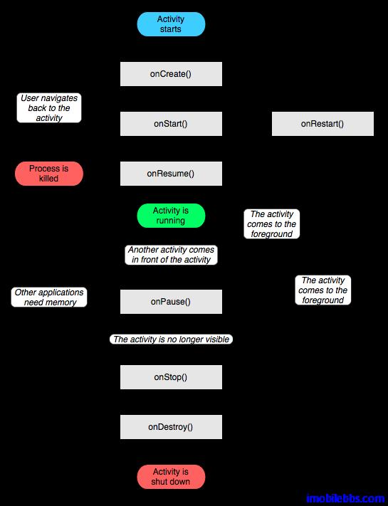

# Activities

Android 应用中的 Activity 指具有屏幕显示支持用户交互的基本模块，类似于 Java ME 中的MIDlet， Windows 应用中的 Form。比如可以是拨号，发送邮件的 UI。每个 Activity 都可以含有一个 Windows 用于绘制用户界面。这个 Windows 提出占据整个屏幕，但也可以只占据部分屏幕或说现在在其它 UI 上面。

一个 Android 应用通常由多个 Activity 组成，其中有一个“主 Activity”，为用户启动应用时第一个显示的 UI 。Activity 可以启动其它 Activity 来实现其它功能。新的 Activity 又可以再启动新的 Activity。新启动的 Activity 的 UI 将覆盖之前的 UI。从而形成一个“UI 栈”。新启动的Activity 将暂停上一个 Activity 的运行。当用户按“BACK”按键时，“UI 栈”最上的 Activity 出栈，之前的 UI 重新显示在屏幕上并恢复该 UI 对应的 Activity 的运行。这意味着 Activiy 具有一个“生命周期”。

写过 MIDlet 或是 Windows Mobile 应用的对以上“生命周期”不会陌生。MIDlet 也有类似的生命周期。Windows Form 也有 Load, Unload , Active 等事件。和桌面系统不太一样的说，一般来说移动应用的生命周期不受应用本身控制，而是有手机操作系统来决定。Activity 则实现对每个生命周期事件的处理来完成某个功能。比如在 onCreate()事件中调用 setContentView()来设置 UI 布局。在onPause()事件中暂停下载，使用 GPS 等，在 onResume()事件中恢复下载，重连 GPS 设备等。

Tags: [Android](http://www.imobilebbs.com/wordpress/archives/tag/android)
