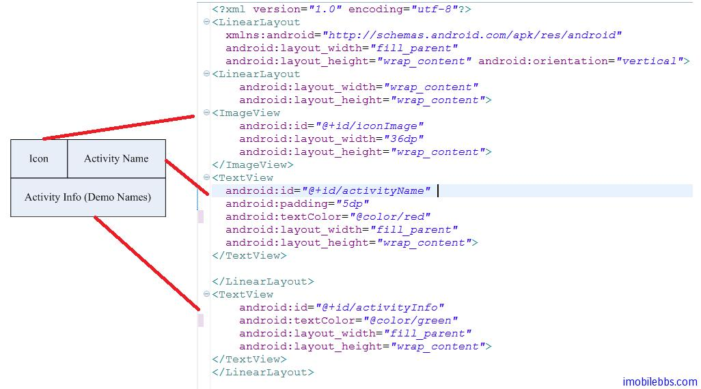

# 自定义 Adapter 显示列表


在介绍数据绑定时，我们使用了系统自带的 SimpleAdapter。Android 允许自定义 Adapter ，理论上可以使用任意的 View（Layout）来显示数据。下图是对 AndroidGraphics2DTutorial 做改动，使用自定义 Adapter 来显示示例 Activity 列表。


在例子中我们把原来的 AndroidGraphics2DTutorial 改名为 AndroidGraphics2DTutorial1，重新创建一个类 AndroidGraphics2DTutorial 来显示示例列表。打算使用三个 View 来显示列表中的一项，一个图标（例子中随机使用了一些图标），一个文本框显示示例 Activity 名称，另一个文本框显示示例的具体信息。在 res\layout 目录下创建一个 activitylist.xml。内容如下：




这次我们不从 AndroidManifest.xml 中读取 Activity 列表，而是使用 String Array 资源。在res\value\string.xml 中添加下列 Array 资源：

```
<string-array name=”activity_name”>       
  <item>Bezier</item>       
  <item>Brush</item>       
  <item>Colors</item>       
  <item>Font</item> 
  <item>Image</item>
  <item>Path</item>
  <item>Pen</item>
  <item>Shape</item> 
  <item>Transform</item>
 </string-array>
 
 <string-array name=”activity_info”>       
  <item>Bezier</item>       
  <item>Pattern ,Gradients</item>       
  <item>Colors</item>       
  <item>FontDemo, FontTypes</item> 
  <item>DrawMap, JumbleImage, SeeThroughImage</item>
  <item>Polys, Paths</item>
  <item>Lines, Dashes, LineCap,LineJoin</item>
  <item>Oval ,Pear ,Shape2DDemo</item> 
  <item>Transform</item>
 </string-array>
```

定义了这些资源后，可以在程序中使用自定义 Adapter 来显示列表：

```
class ActivityInfo{
 int iconIndex;
 String activityName;
 String activityInfo;
}

class ActivityInfoAdapter extends ArrayAdapter<ActivityInfo>{

 int resource;
 public ActivityInfoAdapter(Context context, int resourceId,
   List<ActivityInfo> objects) {
  super(context, resourceId, objects);
  resource=resourceId;
 }
 
 @Override
 public View getView(int position,View ConvertView,ViewGroup parent){
  LinearLayout activityInfoView;
  ActivityInfo activityInfo=getItem(position);
  String activity_Name=activityInfo.activityName;
  String activity_Info=activityInfo.activityInfo;
  int iconIndex=activityInfo.iconIndex;
  if(ConvertView==null){
   activityInfoView=new LinearLayout(getContext());
   String inflater=Context.LAYOUT_INFLATER_SERVICE;
   LayoutInflater vi;
   vi=(LayoutInflater)getContext().getSystemService(inflater);
   vi.inflate(resource, activityInfoView,true);
  }else{
   activityInfoView=(LinearLayout)ConvertView;
  }
  TextView activity_NameView
    =(TextView)activityInfoView.findViewById(R.id.activityName);
  TextView activity_InfoView
     =(TextView)activityInfoView.findViewById(R.id.activityInfo);
  ImageView iconView
     =(ImageView)activityInfoView.findViewById(R.id.iconImage);
  activity_NameView.setText(activity_Name);
  activity_InfoView.setText(activity_Info);
  iconView.setImageResource(iconIndex);
  return activityInfoView;
  
 }
}

public class AndroidGraphics2DTutorial extends ListActivity {

 private ArrayList<ActivityInfo> activityInfos
     =new ArrayList<ActivityInfo>();
 private ActivityInfoAdapter aa;
 private final static String packgeName="com.pstreets.graphics2d";
 
 @Override
 public void onCreate(Bundle savedInstanceState) {
  super.onCreate(savedInstanceState);
  Resources res = getResources();
  String[] activity_Names = res.getStringArray(R.array.activity_name);
  String[] activity_Infos = res.getStringArray(R.array.activity_info);
  for(int i=0;i<activity_Names.length;i++){
   ActivityInfo activityInfo=new ActivityInfo();
   activityInfo.activityName=activity_Names[i];
   activityInfo.activityInfo=activity_Infos[i];
   activityInfo.iconIndex=R.drawable.icon1+i;
   activityInfos.add(activityInfo);
  }
  
  aa=new ActivityInfoAdapter(this,R.layout.activitylist,activityInfos);
  setListAdapter(aa);
 }
 
 @Override
 protected void onListItemClick(ListView l, View v, int position, long id) {
  ActivityInfo activityInfo = (ActivityInfo) l.getItemAtPosition(position);
  Intent intent = new Intent();
  intent.setClassName(this,
       packgeName+".example." +activityInfo.activityName);
  startActivity(intent);
 }
}
```

类 ActivityInfo 定义列表每个元素的 Data Model，为 Activity 的 Icon 资源 ID，Activity Name以及Activity Info.

类 ActivityInfoAdapter 为自定义 Adapter，关键的是 public View getView(int position,View ConvertView,ViewGroup parent)。这个函数返回用来显示没个类别元素的 View的示例。例子中为 activitylist.xml 对应的 Layout。

这个例子使用的列表框，自定义 Adapter 适用所有 AdapterView，如 Spinner，Gallery 等。

Tags: [Android](http://www.imobilebbs.com/wordpress/archives/tag/android)


