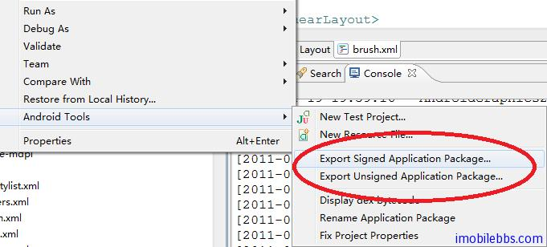

# 發布應用

到這裡基本介紹了 Android 開發的一些基本知識，在開發實際應用時最常用的幾個參考是：

- The Developer’s Guide
- Android References
- Android Resources
最後一個是Google.com ：-）

寫好應用後，在設備上測試後，最後一步是發布你的應用。和 Java ME 平台類似的，Android 應用也需要進行數字簽名後才能發布。但和 Java ME 不同的，Android 用來簽名的數字證書並不需要經過 CA認證，這可以每年省下$400-$500的費用，iPhone 每年需交$100費用。Android 平台開發對於開發者來說是投資最小的，從長遠看也是最有發展前途的一個手機平台之一。

發布 Android 應用前，可以使用工具（如 keytool）創建一個私鑰來對應用進行數字簽名。Keytool 在 JDK 中。

用法如下：

$ keytool -genkey -v -keystore my-release-key.keystore
-alias alias_name -keyalg RSA -keysize 2048 -validity 10000

具體含義可參見：http://developer.android.com/guide/publishing/app-signing.html

除了數字簽名之外，還可以對應用進行擾碼，如果使用 Eclipse 來開發 Android 應用，在創建的每個Android 應用中都有一個 proguard.cfg 文件，一般使用缺省設置即可。擾碼（或稱混淆）的好處是保護源碼和去除一些無用代碼可以是最後的發行包大大縮小。proguard 的詳細用法可以參見 http://proguard.sourceforge.net/

如果使用 Eclipse 來發布最後的 .apk 文件，可以通過 Android Tool 菜單嚮導來一步步來完成：

Tags: [Android](http://www.imobilebbs.com/wordpress/archives/tag/android)
