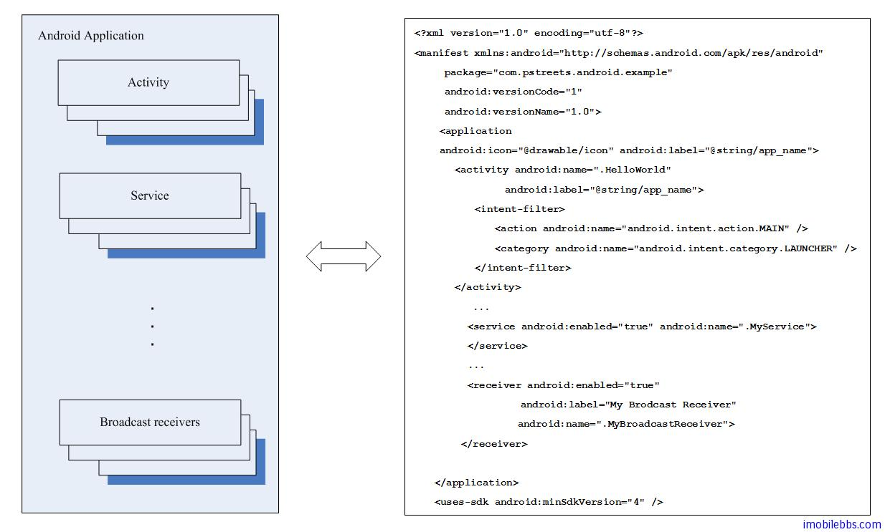

# Android 应用基本概念

Android 平台的一个显著的特点是“低耦合”。Activity 是 Android 应用的一个最基本的用户 UI 模块。如果采用 Windows Form 应用作为参照，Activity 相当于 Windows 中的 WinForm。和 Windows 应用不同的是，运行一个 Activity 或是 Activity 之间的交互是通过消息来实现的。也就是说如果想在起动一个 Activity 或是在一个 Activity 中启动另一个 Activity，是通过发送Intent 消息来触发，而不像 Windows WinForm 应用，需要调 Form 示例的 Show 或是 Load 方法来实现。通过 Intent 消息来实现 Activity 之间的交互，则最大程度上减小了模块之间的耦合度。这种机制类同 Subscriber/Publisher 机制。

Android 平台的另外一个重要特性是“重用”。一个 Android 应用可以有多个 Activity 组成。拿扑克牌做比方，Android 应用相当于扑克牌的盒子，盒子里的每张牌就是一个相对独立的 Activity。这个Android 应用运行时想当于从扑克牌中抽取牌叠放在一起，最先抽出的牌就是 Android 应用的主Activity，主 Activity 可以在调用其它 Activity（通过发 Intent 消息），被触发的 Activity 就像扑克牌一样发在主 Activity 上面。这样就形成一个“Activity”栈。在设备上按“Back”则可以如浏览器一样回到上一个 Activity。 Android 手机上每个应用都是一样的结构。“重用”指 Android 应用在运行时，可以触发其它应用中定义的 Activity。比如说在 GTalk 中想显示某个朋友在地图上的位置。而 GoogleMap 应用可以显示地图。GTalk 不需要重复同样的代码或是对于类似的 Activity。可以直接通过 Intent 消息来启动 GoogleMap 中的 MapViewActivity。

下图显示了 Android 应用的基本组成部分。



除了 Activity 之外，Android 也可以实现 Service，Service 类同 Windows Service，一般在后台运行，不含用户界面。Brodcast Receiver 可以用来响应一些系统消息。基本功能有点类似 Java ME 中的 PushRegistry。 比方说你想在收到短信时触发你的应用，可以在 Android 应用的 Manifest 文件中定义一个 Broadcast Receiver 来触发一个 Activity。

如上图所示，Android 应用中，Application 对象好像一个容器，里面可以包含多个 Activity，多个 Service 或是多个 Broadcast Receiver。这些 Activity，Service，Broadcast Receiver 相对独立，相互之间交互只能通过 Intent 消息。如同 Java ME 的 MIDlet 的 JAD 文件一样，每个Android 应用都有一个 Manifest 文件，文件名固定为 AndroidManifest.xml。Android 应用中定义的 Activity，Service，Broadcast Receiver 等都需要定义在这个 Mainifest 文件中才能被本应用或是其它应用所调用。 这里还是借用 Publisher/Subscriber 的概念来说明。 一个 Activity，Service 等 如果能被调用的话则需要在 Mainifest 中 Subscriber 某类消息。

```
<activity android:name=”.HelloWorld”
                  android:label=”@string/app_name”>
            <intent-filter>
                <action android:name=”android.intent.action.MAIN” />
                <category android:name=”android.intent.category.LAUNCHER” />
            </intent-filter>
        </activity>
```

上面是 HelloWorld 中主 Activity 在 AndroidManifest.xml 的定义，定义了这个 Activity 的对应的 class，以及可以触发该 Activity 的 intent-filter ，（相当于 Subscriber 某种消息），但用户点击该应用图标时，Android 操作系统将发送一个 Intent 消息，Android 系统检查subscribe 该 Intent 消息的 Activity，Service 或是 Broadcast Receiver，如果找到，则其动该 Activity，Service 或是 Broadcast Receiver。对于 HelloWorld，则在屏幕上显示“Hello World”。 除了系统可以发送 Intent 外，Android 引用也可以通过 startActivity(Intent) ,StartService(Intent)来向启动其它 Activity 或是 Service。Intent 可以带传入数据（参数）。即使在同一个应用中，也需要通过 Intent 来传送信息，这样大大降低了应用中各个模块之间的耦合度，从而可以无缝更换应用中的某个模块而不会影响其它部分。 刚开始接触 Android 这种机制时可能会觉得不如 WinForm 的 (new Form1()).Show()来的直接方便。但从应用的可维护性，可扩展性来看，Android 这种低耦合设计是非常有利的。 此外，如果需要在多个 Activity 这间共享一些数据，可以通过扩展 Application 类实现，在 Application 类中定义的变量可以被应用中所有Activity 所访问。

Tags: [Android](http://www.imobilebbs.com/wordpress/archives/tag/android)
