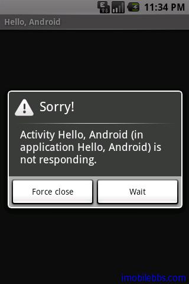
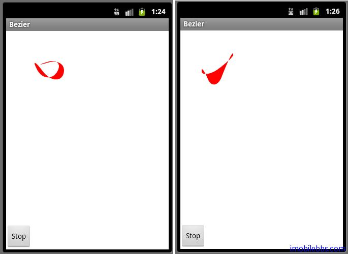

# 线程 Bezier 曲线

Android 中使用线程 Thread 的方法和 Java SE 相同。和大多数 OS 系统一样，Android 中也有称为 UI Thread 的主线程。UI Thread 主要用来给相应的 Widget 分发消息，包括绘制（Drawing）事件。UI Thread 也是用来处理用户交互事件的线程。比如：如果你按下屏幕上某个按钮，UI 线程则将Touch 事件通知对应的控件（Widgets)，Widget 则将其状态设置成“按下”，并把“重绘”（Invalidate）事件发到 Event Queue 中去。 UI 线程从 Event Queue 中读取事件后通知Widgets 重画自身。 

如果你的应用设计不好的话， UI 线程的这种单线程模式就会导致非常差的用户响应性能。特别是你将一些费时的操作如网络访问或数据库访问也放在 UI 线程中，这些操作会造成用户界面无反应，最糟糕的是，如果 UI 线程阻塞超过几秒（5秒），著名的 ANR 对话框就会出现： 



所以在设计应用时，需要把一些费时的任务使用单独的工作线程来运行避免阻塞 UI 线程，但是如果在工作线程中想更新 UI 线程的话，不能直接在工作线程中更新 UI，这是因为 UI 线程不是“Thread Safe”。因此所有 UI 相关的操作一般必须在 UI Thread 中进行。 

Android OS 提供了多种方法可以用在非 UI 线程访问 UI 线程。 

- Activity.runOnUiThread(Runnable)
- View.post(Runnable)
- View.postDelayed(Runnable, long)
- Handler

Bezier 示例动态显示 Bezier 曲线，使用了 Activity.runOnUiThread 来更新屏幕，完整代码如下：

```
public class Bezier extends Graphics2DActivity
implements OnClickListener,Runnable{ 

 /**
     * The animation thread.
     */
    private Thread thread;
    private volatile boolean stopThread=false;
    private boolean stopOrNot=false;
    boolean drawn;
    /**
     * The random number generator.
     */
    static java.util.Random random = new java.util.Random();
    /**
     * The animated path
     */
    Path path = new Path();
    /**
     * Red brush used to fill the path.
     */
    SolidBrush brush = new SolidBrush(Color.RED);
    private static final int NUMPTS = 6;
    private int animpts[] = new int[NUMPTS * 2];
    private int deltas[] = new int[NUMPTS * 2];
    long startt, endt;
   
 private Button btnOptions;
 @Override
 protected void drawImage() {
   drawDemo(100, 100);
  
 }
 
 public void onCreate(Bundle savedInstanceState) {
  super.onCreate(savedInstanceState);
  setContentView(R.layout.beziers);
  graphic2dView
     = (GuidebeeGraphics2DView) findViewById(R.id.graphics2dview);
  btnOptions = (Button) findViewById(R.id.btnStopStart);
  btnOptions.setOnClickListener(this);
  reset(100,100);
  if (thread == null) {
            thread = new Thread(this);
            thread.start();
        }
  
 } 

 @Override
 public void onClick(View view) {
  
  if(!stopOrNot){
   btnOptions.setText("Start");
      stopThread=true;
  }
  else{
   stopThread=false;
   btnOptions.setText("Stop");
   if (thread == null) {
             thread = new Thread(this);
             thread.start();
         }
  }
  stopOrNot=!stopOrNot;
  
 } 
    /**
     * Generates new points for the path.
     */
    private void animate(int[] pts, int[] deltas,
      int i, int limit) {
        int newpt = pts[i] + deltas[i];
        if (newpt <= 0) {
            newpt = -newpt;
            deltas[i] = (random.nextInt() & 0x00000003)
            + 2;
        } else if (newpt >= limit) {
            newpt = 2 * limit - newpt;
            deltas[i] = -((random.nextInt() & 0x00000003)
              + 2);
        }
        pts[i] = newpt;
    } 

    /**
     * Resets the animation data.
     */
    private void reset(int w, int h) {
        for (int i = 0; i < animpts.length; i += 2) {
            animpts[i + 0]
                    = (random.nextInt() & 0x00000003)
                    * w / 2;
            animpts[i + 1]
                    = (random.nextInt() & 0x00000003)
                    * h / 2;
            deltas[i + 0]
                   = (random.nextInt() & 0x00000003)
                   * 6 + 4;
            deltas[i + 1]
                   = (random.nextInt() & 0x00000003)
                   * 6 + 4;
            if (animpts[i + 0] > w / 2) {
                deltas[i + 0] = -deltas[i + 0];
            }
            if (animpts[i + 1] > h / 2) {
                deltas[i + 1] = -deltas[i + 1];
            }
        }
    } 

    final Runnable updateCanvas = new Runnable() {
  public void run() {
   int offsetX = (graphic2dView.getWidth() -
     SharedGraphics2DInstance.CANVAS_WIDTH) / 2;
   int offsetY = (graphic2dView.getHeight()
     - SharedGraphics2DInstance.CANVAS_HEIGHT) / 2;
   graphic2dView.invalidate(offsetX,offsetY,
     offsetX+100,offsetY+100);
  }
 };
    /**
     * Sets the points of the path and draws and fills the path.
     */
    private void drawDemo(int w, int h) {
        for (int i = 0; i < animpts.length; i += 2) {
            animate(animpts, deltas, i + 0, w);
            animate(animpts, deltas, i + 1, h);
        }
        //Generates the new pata data.
        path.reset();
        int[] ctrlpts = animpts;
        int len = ctrlpts.length;
        int prevx = ctrlpts[len - 2];
        int prevy = ctrlpts[len - 1];
        int curx = ctrlpts[0];
        int cury = ctrlpts[1];
        int midx = (curx + prevx) / 2;
        int midy = (cury + prevy) / 2;
        path.moveTo(midx, midy);
        for (int i = 2; i <= ctrlpts.length; i += 2) {
            int x1 = (curx + midx) / 2;
            int y1 = (cury + midy) / 2;
            prevx = curx;
            prevy = cury;
            if (i < ctrlpts.length) {
                curx = ctrlpts[i + 0];
                cury = ctrlpts[i + 1];
            } else {
                curx = ctrlpts[0];
                cury = ctrlpts[1];
            }
            midx = (curx + prevx) / 2;
            midy = (cury + prevy) / 2;
            int x2 = (prevx + midx) / 2;
            int y2 = (prevy + midy) / 2;
            path.curveTo(x1, y1, x2, y2, midx, midy);
        }
        path.closePath();
        // clear the clipRect area before production 

        graphics2D.clear(Color.WHITE);
        graphics2D.fill(brush, path); 

        this.runOnUiThread(updateCanvas); 
    }
   
    

    public void run() {
        Thread me = Thread.currentThread(); 

        if (!drawn) {
            synchronized (this) {
                graphics2D.clear(Color.WHITE);
                graphics2D.fill(brush, path);
                graphic2dView.refreshCanvas();
                drawn = true;
            }
        }
        while (thread == me && !stopThread) {
            drawDemo(100,100);
        }
        thread = null;
    }
}
```



除了上述的方法外，Android 还提供了 AsyncTask 类以简化工作线程与 UI 线程之间的通信。这里不详述。此外，上面 Bezier 曲线动画在屏幕上显示时有闪烁的现象，这是动态显示图像的一个常见问题，后面将专门讨论。

Tags: [Android](http://www.imobilebbs.com/wordpress/archives/tag/android)


