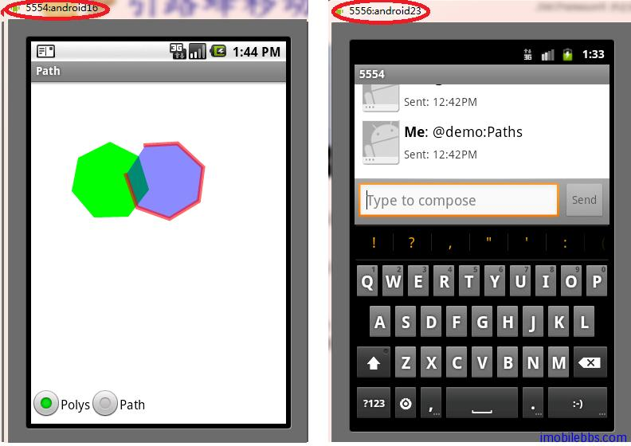

# Broadcast Receiver 短信触发示例

Android 中 BroadCast Receiver 可以用来侦听广播事件。在使用 Broadcast 之前，必须使用代码或是在 AndroidManifest.xml 进行注册。

下面的例子实现使用短信来触发 AndroidGraphics2DTutorial 中的示例。短信格式为：@demo:xxxx ,xxxx为 示例名称，比如， 启动 Colors 示例， 则向手机发送： @demo:Colors . 手机在收到短信后，先检测短信格式是否符合 @demo:xxxx, 若符合，这启动对应的示例。

在 AndroidGraphics2DTutorial 中添加一个自定义的 Broadcast Receiver SmsMessageReceiver 用于监测接受到的短信：

```
public class SmsMessageReceiver extends BroadcastReceiver {
	
   private static final String queryString="@demo:";
    @Override
    public void onReceive(Context context, Intent intent) {
        Bundle extras = intent.getExtras();
        if (extras == null)
            return;

        Object[] pdus = (Object[]) extras.get("pdus");

        for (int i = 0; i < pdus.length; i++) {
            SmsMessage message = SmsMessage.createFromPdu((byte[]) pdus[i]);
            String fromAddress = message.getOriginatingAddress();
            String fromDisplayName = fromAddress;
            String msg=message.getMessageBody();
            if(msg.startsWith(queryString)){
               // Trigger the main activity to fire up a dialog 
          //that shows/reads the received messages
	            Intent di = new Intent();
	            di.setClass(context, AndroidGraphics2DTutorial.class);
	            di.addFlags(Intent.FLAG_ACTIVITY_NEW_TASK 
	            		| Intent.FLAG_ACTIVITY_SINGLE_TOP);
	            di.putExtra(AndroidGraphics2DTutorial.SMS_FROM_ADDRESS_EXTRA,
	            		fromAddress);
	            di.putExtra(AndroidGraphics2DTutorial.SMS_FROM_DISPLAY_NAME_EXTRA, 
	            		fromDisplayName);
	            di.putExtra(AndroidGraphics2DTutorial.SMS_MESSAGE_EXTRA, msg);
	            context.startActivity(di);
            }


        }
    }
}
```

onReceive 会在 Broadcast 事件发生是执行，这里检测短信内容，如果是以@demo:开头的，则启动AndroidGraphics2DTutorial Main Activity。

修改 AndroidMainifest.xml

```
<receiver android:name=".SmsMessageReceiver" android:enabled="true">
            <intent-filter>
                <action android:name="android.provider.Telephony.SMS_RECEIVED" />
            </intent-filter>
 </receiver>
```

同时添加 permission ，和 Java ME 类似 Android 某些 API 需要指定对应的 Permission 才可以使用。

```
<uses-permission android:name="android.permission.SEND_SMS" />
<uses-permission android:name="android.permission.RECEIVE_SMS" />
```

修改 AndroidGraphics2DTutorial.java 来处理 SMS 消息：

```
public void onCreate(Bundle savedInstanceState) {
		super.onCreate(savedInstanceState);
		Resources res = getResources();
		String[] activity_Names = res.getStringArray(R.array.activity_name);
		String[] activity_Infos = res.getStringArray(R.array.activity_info);
		for(int i=0;i<activity_Names.length;i++){
			ActivityInfo activityInfo=new ActivityInfo();
			activityInfo.activityName=activity_Names[i];
			activityInfo.activityInfo=activity_Infos[i];
			activityInfo.iconIndex=R.drawable.icon1+i;
			activityInfos.add(activityInfo);
		}
		
		aa=new ActivityInfoAdapter(this,R.layout.activitylist,activityInfos);
		setListAdapter(aa);
		Bundle bundle=getIntent().getExtras();
		if(bundle!=null){
			 mFromAddress = bundle.getString(SMS_FROM_ADDRESS_EXTRA);
		     mMessage = bundle.getString(SMS_MESSAGE_EXTRA);
		     int index=mMessage.indexOf(queryString);
		     if(index>=0){
		    	 String demoName=mMessage.substring(index+queryString.length());
		    	 Intent intent = new Intent();
		 		 intent.setClassName(this, packgeName+".example." +demoName);
		 		 startActivity(intent);
		    	
		     }
			 
		}
	}
	
```

下面来测试，如果使用设备，则给手机发送@demo:Colors .
如果使用模拟器，则可以启动两个模拟器：



模拟器左上角数字5554，5556为模拟器的号码。发送@demo:Paths ,则自动触发 Paths 示例，如果AndroidGraphics2DTutorial 没有运行，手机收到 SMS 短信后，会自动启动应用。

Tags: [Android](http://www.imobilebbs.com/wordpress/archives/tag/android)


