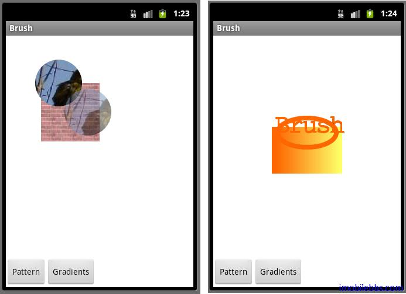

# Button 画刷示例

将 RadioButton 换成 Button ，类似的在 res\layout 中新建 brush.xml： 

```
<?xml version=”1.0″ encoding=”utf-8″?>
<LinearLayout xmlns:android=”[http://schemas.android.com/apk/res/android](http://schemas.android.com/apk/res/android)”
    android:orientation=”vertical”
    android:background=”@drawable/white”
 android:layout_width=”fill_parent”
 android:layout_height=”fill_parent”>
    <com.pstreets.graphics2d.GuidebeeGraphics2DView
     android:id=”@+id/graphics2dview”
     android:layout_weight=”1″
     android:layout_width=”fill_parent”
     android:layout_height=”wrap_content”/>
 <LinearLayout xmlns:android=”[http://schemas.android.com/apk/res/android](http://schemas.android.com/apk/res/android)”
  android:layout_width=”wrap_content” android:layout_height=”wrap_content”
  android:orientation=”horizontal”
```

```
>
  
   <Button android:text=”Pattern”
       android:id=”@+id/btnPattern”
    android:layout_width=”wrap_content”
    android:textColor=”@color/black”
    android:checked=”true”
    android:layout_height=”wrap_content”>
   </Button>
   <Button android:text=”Gradients”
        android:id=”@+id/btnGradients”
    android:layout_width=”wrap_content”
    android:textColor=”@color/black”
    android:layout_height=”wrap_content”>
   </Button>
 
 </LinearLayout> 

</LinearLayout> 
```

修改 Brushes.java ,完整代码如下： 

```
public class Brushes extends Graphics2DActivity
   implements OnClickListener { 

 private Button btnPattern;
 private Button btnGradients; 

 public void onCreate(Bundle savedInstanceState) {
  super.onCreate(savedInstanceState);
  setContentView(R.layout.brush);
  graphic2dView = (GuidebeeGraphics2DView)
      findViewById(R.id.graphics2dview);
  btnPattern = (Button) findViewById(R.id.btnPattern);
  btnGradients = (Button) findViewById(R.id.btnGradients);
  btnPattern.setOnClickListener(this);
  btnGradients.setOnClickListener(this);
 } 

 @Override
 protected void drawImage() {
  drawPatterns(); 

 } 

 @Override
 public void onClick(View view) {
  if (view == btnPattern) {
   drawPatterns();
  } else {
   drawGradient();
  }
  graphic2dView.refreshCanvas(); 

 } 

 private void drawPatterns() {
  TextureBrush brush1;
  TextureBrush brush2;
  TextureBrush brush3; 

  AffineTransform matrix1 = new AffineTransform();
  AffineTransform matrix2 = new AffineTransform();
  Bitmap bitmap
    = BitmapFactory.decodeResource(getResources(),
    R.drawable.brick);
  int[] rgbData = new int[bitmap.getHeight()
                          * bitmap.getWidth()];
  bitmap.getPixels(rgbData, 0, bitmap.getWidth(), 0, 0,
    bitmap.getWidth(), bitmap.getHeight());
  brush1 = new TextureBrush(rgbData, bitmap.getWidth(),
    bitmap.getHeight()); 

  bitmap = BitmapFactory.decodeResource(getResources(),
    R.drawable.bird);
  rgbData = new int[bitmap.getHeight() * bitmap.getWidth()];
  bitmap.getPixels(rgbData, 0, bitmap.getWidth(), 0, 0,
    bitmap.getWidth(), bitmap.getHeight());
  brush2 = new TextureBrush(rgbData, bitmap.getWidth(),
    bitmap.getHeight());
  brush3 = new TextureBrush(rgbData, bitmap.getWidth(),
    bitmap.getHeight(), 127);
  matrix2.translate(50, 50);
  // Clear the canvas with white color.
  graphics2D.clear(Color.WHITE);
  graphics2D.setAffineTransform(matrix1);
  graphics2D.fillRectangle(brush1,
     new Rectangle(20, 50, 100, 100));
  graphics2D.fillOval(brush2, 10, 10, 80, 80);
  graphics2D.setAffineTransform(matrix2);
  graphics2D.fillOval(brush3, 10, 10, 80, 80); 

 } 

 private void drawGradient() {
  /* The linear gradient color */
  LinearGradientBrush brush1;
  /* The radial gradient color */
  RadialGradientBrush brush2;
  /* The second radial gradient color */
  RadialGradientBrush brush3; 

  char[] engText = "Brush".toCharArray(); 

  FontEx font = FontEx.getSystemFont(); 

  int fontSize = 44;
  int X = 15;
  int Y = 50;
  int[] fractions = new int[] { 13, 242 };
  Color[] colors = new Color[] { new Color(0xffff6600),
    new Color(0xffffff66) };
  brush1 = new LinearGradientBrush(50, 50, 150, 125,
    fractions, colors,
    Brush.NO_CYCLE); 

  fractions = new int[] { 13, 128, 255 };
  colors = new Color[] { new Color(0xffff6600),
    new Color(0xffffff66),
    new Color(0xffff6600) };
  brush2 = new RadialGradientBrush(90, 100, 50,
    fractions, colors); 

  fractions = new int[] { 0, 255 };
  colors = new Color[] { new Color(0xFFFFFF00),
    new Color(0xFF000000) };
  brush3 = new RadialGradientBrush(50, 50, 100,
    fractions, colors);
  // Clear the canvas with white color.
  graphics2D.clear(Color.white);
  graphics2D.fillRectangle(brush1,
    new Rectangle(10, 75, 120, 80)); 

  Pen pen = new Pen(brush2, 8);
  graphics2D.drawOval(pen, 20, 60, 100, 50);
  graphics2D.setDefaultBrush(brush3);
  pen = new Pen(brush2, 2);
  graphics2D.setDefaultPen(pen);
  graphics2D.drawChars(font, fontSize, engText, 0,
    engText.length, X, Y);
 } 

}
```



介绍了 RadioButton和Button 后，这时应该对使用 Android 提供的控件的用法有了基本的认识。 控件提供了 onClick(),onLongClick(),onFocusChange(),onKey(),onTouch(),onCreateContextMenu()等多种事件以相应用户。用多种方法来处理用户事件。一种是示例代码同过 Activity 实现OnClickListener 接口，再有是采用如下代码为 Button 支持事件处理方法：

```
// Create an anonymous implementation of OnClickListenerprivate
OnClickListener mCorkyListener = new OnClickListener() {   
   public void onClick(View v) {     
   // do something when the button is clicked  
   }
};

protected void onCreate(Bundle savedValues) {   
   ...  
   // Capture our button from layout   
   Button button = (Button)findViewById(R.id.corky);   
   // Register the onClick listener with the implementation above  
   button.setOnClickListener(mCorkyListener);  
   ...
 }
```

在创建自定义控件时，也可以重载 onKeyDown(int, KeyEvent),onKeyUp(int, KeyEvent) ,onTouchEvent(MotionEvent)等来处理用户事件。

Tags: [Android](http://www.imobilebbs.com/wordpress/archives/tag/android)
