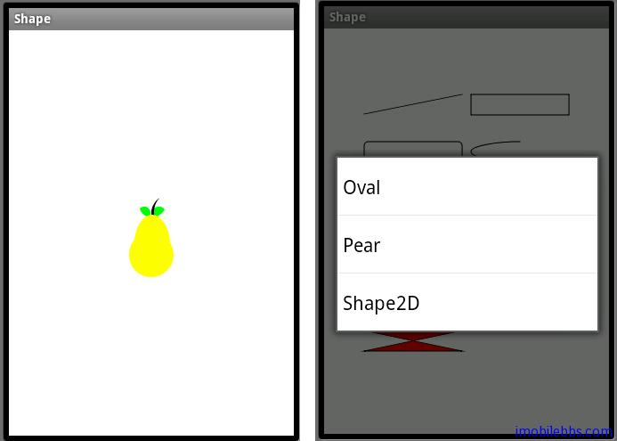

# Context Menu 绘制几何图形

上下文相关菜单（Context Menu）类同 PC 上按鼠标右键显示的菜单，在 Android 平台上是长按来激活Context Menu，Context Menu 一般用来显示和当前UI内容相关的菜单。

Context Menu 的用法和 Option Menu 非常类似：

首先是创建 菜单资源，在 res\menu 下新建 menu_context_shape.xml，用来显示 Oval，Pear，Shape2D:
```
<?xml version=”1.0″ encoding=”utf-8″?>
<menu
  xmlns:android=”[http://schemas.android.com/apk/res/android](http://schemas.android.com/apk/res/android)“>
<item
   android:id=”@+id/mnuOval”
   android:title=”Oval”>
</item>
<item
    android:id=”@+id/mnuPear”
    android:title=”Pear”>
</item>
<item
    android:id=”@+id/mnuShape2DDemo”
    android:title=”Shape2D”>
</item>
</menu>
```
展开 Context Menu，是通过 onCreateContextMenu 方法：

```
@Override
public void onCreateContextMenu(ContextMenu menu, View v,
  ContextMenuInfo menuInfo) {
 super.onCreateContextMenu(menu, v, menuInfo);
 MenuInflater inflater = getMenuInflater();
 inflater.inflate(R.menu.menu_context_shape, menu);
}
```

处理 Context Menu 事件：

```
@Override
public boolean onContextItemSelected(MenuItem item) {

 menuOption = item.getItemId();
 drawImage();
 return super.onContextItemSelected(item);

}
```

为了在长按时能在 View 上显示 Context Menu，需要为 View 注册 Context Menu：

```
public void onCreate(Bundle savedInstanceState) {
 super.onCreate(savedInstanceState);
 registerForContextMenu(graphic2dView);
}
```



完整代码如下：

```
public class Shape extends Graphics2DActivity {

 private int menuOption;

 public void onCreate(Bundle savedInstanceState) {
  super.onCreate(savedInstanceState);
  registerForContextMenu(graphic2dView);
 }

 @Override
 protected void drawImage() {
  switch (menuOption) {
  case R.id.mnuOval:
   drawOval();
   break;
  case R.id.mnuPear:
   drawPear();
   break;
  case R.id.mnuShape2DDemo:
   drawShape2D();
   break;
  default:
   drawOval();
   break;
  }
  graphic2dView.refreshCanvas();

 }

 @Override
 public void onCreateContextMenu(ContextMenu menu, View v,
   ContextMenuInfo menuInfo) {
  super.onCreateContextMenu(menu, v, menuInfo);
  MenuInflater inflater = getMenuInflater();
  inflater.inflate(R.menu.menu_context_shape, menu);
 }

 @Override
 public boolean onContextItemSelected(MenuItem item) {

  menuOption = item.getItemId();
  drawImage();
  return super.onContextItemSelected(item);

 }

 private void drawOval() {
  AffineTransform mat1;

  /** Colors */
  Color redColor = new Color(0x96ff0000, true);
  Color greenColor = new Color(0xff00ff00);
  mat1 = new AffineTransform();
  mat1.translate(30, 40);
  mat1.rotate(-30 * Math.PI / 180.0);
  // Clear the canvas with white color.
  graphics2D.clear(Color.WHITE);
  graphics2D.Reset();

  graphics2D.setAffineTransform(new AffineTransform());
  SolidBrush brush = new SolidBrush(greenColor);
  graphics2D.fillOval(brush, 20, 60, 100, 50);

  com.mapdigit.drawing.Pen pen
     = new com.mapdigit.drawing.Pen(redColor, 5);
  graphics2D.setAffineTransform(mat1);
  graphics2D.drawOval(pen, 20, 60, 100, 50);
 }

 private void drawPear() {
  Ellipse circle, oval, leaf, stem;
  Area circ, ov, leaf1, leaf2, st1, st2;
  circle = new Ellipse();
  oval = new Ellipse();
  leaf = new Ellipse();
  stem = new Ellipse();
  circ = new Area(circle);
  ov = new Area(oval);
  leaf1 = new Area(leaf);
  leaf2 = new Area(leaf);
  st1 = new Area(stem);
  st2 = new Area(stem);
  graphics2D.clear(Color.WHITE);
  graphics2D.Reset();
  int w = SharedGraphics2DInstance.CANVAS_WIDTH;
  int h = SharedGraphics2DInstance.CANVAS_HEIGHT;
  int ew = w / 2;
  int eh = h / 2;
  SolidBrush brush = new SolidBrush(Color.GREEN);
  graphics2D.setDefaultBrush(brush);
  // Creates the first leaf by filling the
  //intersection of two Area
  // objects created from an ellipse.
  leaf.setFrame(ew - 16, eh - 29, 15, 15);
  leaf1 = new Area(leaf);
  leaf.setFrame(ew - 14, eh - 47, 30, 30);
  leaf2 = new Area(leaf);
  leaf1.intersect(leaf2);
  graphics2D.fill(null, leaf1);

  // Creates the second leaf.
  leaf.setFrame(ew + 1, eh - 29, 15, 15);
  leaf1 = new Area(leaf);
  leaf2.intersect(leaf1);
  graphics2D.fill(null, leaf2);

  brush = new SolidBrush(Color.BLACK);
  graphics2D.setDefaultBrush(brush);

  // Creates the stem by filling the Area
  //resulting from the subtraction of two
  //Area objects created from an ellipse.
  stem.setFrame(ew, eh - 42, 40, 40);
  st1 = new Area(stem);
  stem.setFrame(ew + 3, eh - 47, 50, 50);
  st2 = new Area(stem);
  st1.subtract(st2);
  graphics2D.fill(null, st1);

  brush = new SolidBrush(Color.YELLOW);
  graphics2D.setDefaultBrush(brush);

  // Creates the pear itself by filling the
  //Area resulting from the union of two Area
  //objects created by two different ellipses.
  circle.setFrame(ew - 25, eh, 50, 50);
  oval.setFrame(ew - 19, eh - 20, 40, 70);
  circ = new Area(circle);
  ov = new Area(oval);
  circ.add(ov);
  graphics2D.fill(null, circ);
 }

 private void drawShape2D() {
  Color bg = Color.white;
  Color fg = Color.black;
  Color red = Color.red;
  Color white = Color.white;
  com.mapdigit.drawing.Pen pen
     = new com.mapdigit.drawing.Pen(fg, 1);
  SolidBrush brush = new SolidBrush(red);
  // Clear the canvas with white color.
  graphics2D.clear(bg);
  graphics2D.Reset();
  Dimension d = new Dimension(SharedGraphics2DInstance.CANVAS_WIDTH,
    SharedGraphics2DInstance.CANVAS_HEIGHT);
  int gridWidth = d.width / 2;
  int gridHeight = d.height / 6;

  int x = 5;
  int y = 7;
  int rectWidth = gridWidth - 2 * x;
  int stringY = gridHeight - 3 - 2 - 16;
  int rectHeight = stringY - y - 2;
  graphics2D.draw(pen, new Line(x, y + rectHeight - 1,
    x + rectWidth, y));
  x += gridWidth;
  graphics2D.draw(pen, new Rectangle(x, y, rectWidth,
    rectHeight));
  x += gridWidth;
  x = 5;
  y += gridHeight;
  stringY += gridHeight;
  graphics2D.draw(pen, new RoundRectangle(x, y, rectWidth,
    rectHeight,
    10, 10));
  x += gridWidth;
  graphics2D.draw(pen, new Arc(x, y, rectWidth,
    rectHeight, 90, 135,
    Arc.OPEN));
  x = 5;
  y += gridHeight;
  stringY += gridHeight;
  graphics2D.draw(pen, new Ellipse(x, y, rectWidth,
    rectHeight));
  x += gridWidth;
  // draw GeneralPath (polygon)
  int x1Points[] = { x, x + rectWidth, x,
    x + rectWidth };
  int y1Points[] = { y, y + rectHeight,
    y + rectHeight, y };
  com.mapdigit.drawing.geometry.Path polygon
    = new com.mapdigit.drawing.geometry.Path(
    com.mapdigit.drawing.geometry.Path.WIND_EVEN_ODD,
    x1Points.length);
  polygon.moveTo(x1Points[0], y1Points[0]);
  for (int index = 1; index < x1Points.length; index++) {
   polygon.lineTo(x1Points[index], y1Points[index]);
  }
  polygon.closePath();
  graphics2D.draw(pen, polygon);
  x = 5;
  y += gridHeight;
  stringY += gridHeight;
  int x2Points[] = { x, x + rectWidth, x, x + rectWidth };
  int y2Points[] = { y, y + rectHeight, y + rectHeight, y };
  com.mapdigit.drawing.geometry.Path polyline
    = new com.mapdigit.drawing.geometry.Path(
    com.mapdigit.drawing.geometry.Path.WIND_EVEN_ODD,
    x2Points.length);
  polyline.moveTo(x2Points[0], y2Points[0]);
  for (int index = 1; index < x2Points.length; index++) {
   polyline.lineTo(x2Points[index], y2Points[index]);
  }
  graphics2D.draw(pen, polyline);
  x += gridWidth;
  graphics2D.setPenAndBrush(pen, brush);
  graphics2D.fill(null,
    new Rectangle(x, y, rectWidth, rectHeight));
  graphics2D.draw(null,
    new Rectangle(x, y, rectWidth, rectHeight));
  x = 5;
  y += gridHeight;
  stringY += gridHeight;
  Color[] colors = new Color[] { red, white };
  int[] fractions = new int[] { 0, 255 };
  LinearGradientBrush redtowhite
      = new LinearGradientBrush(x, y, x
    + rectWidth, y, fractions, colors,
    com.mapdigit.drawing.Brush.NO_CYCLE);
  graphics2D.setPenAndBrush(pen, redtowhite);
  graphics2D.fill(null, new RoundRectangle(x, y, rectWidth,
    rectHeight,
    10, 10));
  graphics2D.draw(null, new RoundRectangle(x, y, rectWidth,
    rectHeight,
    10, 10));
  x += gridWidth;
  graphics2D.setPenAndBrush(pen, brush);
  graphics2D.fill(null, new Arc(x, y, rectWidth,
    rectHeight, 90, 135,
    Arc.CHORD));
  graphics2D.draw(null, new Arc(x, y, rectWidth,
    rectHeight, 90, 135,
    Arc.CHORD));
  x = 5;
  y += gridHeight;
  stringY += gridHeight;
  int x3Points[] = { x, x + rectWidth, x, x + rectWidth };
  int y3Points[] = { y, y + rectHeight, y + rectHeight, y };
  com.mapdigit.drawing.geometry.Path filledPolygon
  = new com.mapdigit.drawing.geometry.Path(
    com.mapdigit.drawing.geometry.Path.WIND_EVEN_ODD,
    x3Points.length);
  filledPolygon.moveTo(x3Points[0], y3Points[0]);
  for (int index = 1; index < x3Points.length; index++) {
   filledPolygon.lineTo(x3Points[index], y3Points[index]);
  }
  filledPolygon.closePath();
  graphics2D.setPenAndBrush(pen, brush);
  graphics2D.fill(null, filledPolygon);
  graphics2D.draw(null, filledPolygon);

 }
}
```

菜单除了这里介绍的功能外，Android 也支持动态菜单或动态修改菜单。具体可以参见 Android 文档。

Tags: [Android](http://www.imobilebbs.com/wordpress/archives/tag/android)
