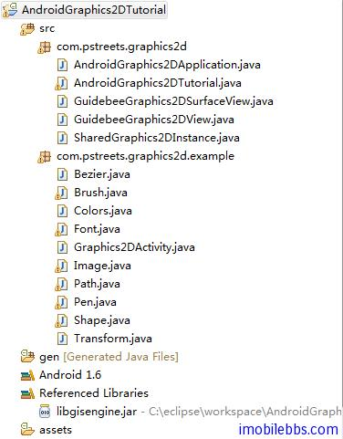
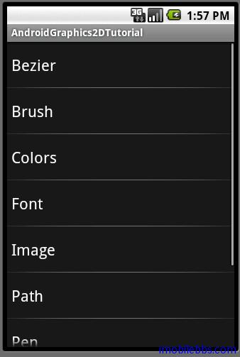

# 创建应用程序框架

Android 简明开发教程八说明了程序需要实现的功能，就可以创建 Android 项目了。请参见 Android简明开发教程三：第一个应用 Hello World ，创建一个新项目 AndroidGraphics2DTutorial。今天先介绍创建的程序的框架。然后再项目添加如下类定义：



## 添加第三方库文件

AndroidGraphics2DTutorial 调用了引路蜂二维图形库，因此需要在项目中添加第三方库引用(libgisengine.jar),打开 Android 属性窗口，添加 External JARs。把 libgisengine.jar 添加到项目中，引路蜂二维图形库是引路蜂地图开发包的一部分。添加库引用可以参见 [Android引路蜂地图开发示例：基本知识](http://www.imobilebbs.com/wordpress/?p=275)。

类说明，下表列出了项目中定义的类的简要说明：

|类|	说明|
|:-----------|:---------|
|AndroidGraphics2DApplication|	应用程序类，为Application子类|
|AndroidGraphics2DTutorial|	主Activity，为ListActivity子类，用于列出其它示例。|
|GuidebeeGraphics2DSurfaceView|	SurfaceView子类用于显示图形|
|GuidebeeGraphics2DView	|View子类用于显示图形，与GuidebeeGraphics2DSurfaceView 功能一样，在程序中可以互换。|
|SharedGraphics2DInstance	|定义了共享类对象，主要包含Graphics2D|
|Graphics2DActivity	|Activity子类，为所有示例基类，定义一些所有示例共享的类变量和函数。|
|Bezier，Brush，Colors，Font，Image，Path，Pen，Shape，Transform	|为Graphics2DActivity的子类，为二维图形演示各个功能|

AndroidGraphics2DApplication ，其实在一般的 Android 应用中，无需定义 Application 的派生类，比如在 Hello World 中就没有定义，当是如果想在多个 Activity 中共享变量，或是想初始化一些全局变量，可以定义 Application 的派生类，然后可以在 Activity 或 Service 中调用 getApplication() 或 getApplicationContext()来取得 Application 对象，可以访问定义在Application 中的一些共享变量。在这个例子中 AndroidGraphics2DApplication 严格些也可不定义，为了说明问题，还是定义了用来初始化 Graphics2D 实例，Graphics2D 实例可以被所有示例Activity，如 Colors，Font 访问。如果定义了 Application 的派生类，就需要在AndroidManifest.xml 中说明 Application 派生类的位置。

```
<manifest xmlns:android=”http://schemas.android.com/apk/res/android”
      package=”com.pstreets.graphics2d”
      android:versionCode=”1″
      android:versionName=”1.0″>
    <application android:name=”AndroidGraphics2DApplication”
         android:icon=”@drawable/icon” android:label=”@string/app_name”>
        <activity android:name=”.AndroidGraphics2DTutorial”
                  android:label=”@string/app_name”>
            <intent-filter>
                <action android:name=”android.intent.action.MAIN” />
                <category android:name=”android.intent.category.LAUNCHER” />
            </intent-filter>
        </activity>
  …
    </application>
    <uses-sdk android:minSdkVersion=”4″ />

</manifest>  
```

Application 可以重载 onCreate()和 onTerminate() ，onCreate()在应用启动时执行一次，onTerminate()在应用推出执行一次。AndroidGraphics2DApplication 的 onCreate() 中初始化Graphics2D 实例：

```
public void onCreate() {
  SharedGraphics2DInstance.graphics2d=
      new Graphics2D(SharedGraphics2DInstance.CANVAS_WIDTH,
        SharedGraphics2DInstance.CANVAS_HEIGHT);
 }
```

```
AndroidGraphics2DTutorial 为ListActivity 子类，直接从 AndroidManifest.xml 中读取Intent-Filter Catetory 为 com.pstreets.graphics2d.SAMPLE_CODE 的所有 Activity。

private static final String SAMPLE_CATEGORY="com.pstreets.graphics2d.SAMPLE_CODE";

Intent mainIntent = new Intent(Intent.ACTION_MAIN, null);
mainIntent.addCategory(SAMPLE_CATEGORY);
...
```

AndroidGraphics2DTutorial 为ListActivity子类，直接从 AndroidManifest.xml 中读取Intent-Filter Catetory 为 com.pstreets.graphics2d.SAMPLE_CODE 的所有 Activity。

```
private static final String SAMPLE_CATEGORY="com.pstreets.graphics2d.SAMPLE_CODE";

Intent mainIntent = new Intent(Intent.ACTION_MAIN, null);
mainIntent.addCategory(SAMPLE_CATEGORY);
...
```

GuidebeeGraphics2DSurfaceView 和 GuidebeeGraphics2DView 分别为 SurfaceView 和 View的子类，都可以用来显示图形结果。在程序中可以互换。

```
package com.pstreets.graphics2d;

import android.content.Context;
import android.graphics.Canvas;
import android.util.AttributeSet;
import android.view.View;

public class GuidebeeGraphics2DView extends View {

 public GuidebeeGraphics2DView(Context context, AttributeSet attrs,
   int defStyle) {
  super(context, attrs, defStyle);

 }

 public GuidebeeGraphics2DView(Context context, AttributeSet attrs) {
  super(context, attrs);

 }

 public GuidebeeGraphics2DView(Context context) {
  super(context);

 }

 public void onDraw(Canvas canvas) {
  super.onDraw(canvas);
  canvas.drawColor(0xFFFFFFFF);
  if (SharedGraphics2DInstance.graphics2d != null) {
   int offsetX = (getWidth() -
     SharedGraphics2DInstance.CANVAS_WIDTH) / 2;
   int offsetY = (getHeight()
     - SharedGraphics2DInstance.CANVAS_HEIGHT) / 2;
   canvas.drawBitmap(SharedGraphics2DInstance.graphics2d.getRGB(), 0,
     SharedGraphics2DInstance.CANVAS_WIDTH,
     offsetX, offsetY,
     SharedGraphics2DInstance.CANVAS_WIDTH,
     SharedGraphics2DInstance.CANVAS_HEIGHT,
     true, null);
  }
 }

}
```

```
package com.pstreets.graphics2d;

import android.content.Context;
import android.graphics.Canvas;
import android.util.AttributeSet;
import android.view.SurfaceHolder;
import android.view.SurfaceView;

public class GuidebeeGraphics2DSurfaceView extends
   SurfaceView implements SurfaceHolder.Callback {

 SurfaceHolder holder;

 private void initHolder() {
  holder = this.getHolder();
  holder.addCallback(this);
 }

 public GuidebeeGraphics2DSurfaceView(Context context,
   AttributeSet attrs,
   int defStyle) {
  super(context, attrs, defStyle);
  initHolder();

 }

 public GuidebeeGraphics2DSurfaceView(Context context,
   AttributeSet attrs) {
  super(context, attrs);
  initHolder();

 }

 public GuidebeeGraphics2DSurfaceView(Context context) {
  super(context);
  initHolder();

 }

 @Override
 public void surfaceChanged(SurfaceHolder arg0,
   int arg1, int arg2, int arg3) {
  // TODO Auto-generated method stub

 }

 @Override
 public void surfaceCreated(SurfaceHolder arg0) {
  new Thread(new MyThread()).start();

 }

 @Override
 public void surfaceDestroyed(SurfaceHolder arg0) {
  // TODO Auto-generated method stub

 }

 class MyThread implements Runnable {

  @Override
  public void run() {
   Canvas canvas = holder.lockCanvas(null);
   canvas.drawColor(0xFFFFFFFF);
   if (SharedGraphics2DInstance.graphics2d != null) {
    int offsetX = (getWidth() -
      SharedGraphics2DInstance.CANVAS_WIDTH) / 2;
    int offsetY = (getHeight() -
      SharedGraphics2DInstance.CANVAS_HEIGHT) / 2;
    canvas.drawBitmap
      (SharedGraphics2DInstance.graphics2d.getRGB(),
      0, SharedGraphics2DInstance.CANVAS_WIDTH,
      offsetX,
      offsetY,
      SharedGraphics2DInstance.CANVAS_WIDTH,
      SharedGraphics2DInstance.CANVAS_HEIGHT,
      true, null);
   }
   holder.unlockCanvasAndPost(canvas);

  }

 }

}
```

SurfaceView 动态显示性能比较好，一般用在游戏画面的显示。图形的绘制可以在单独的线程中完成。

修改 res\layout\main.xml

```
<?xml version=”1.0″ encoding=”utf-8″?>
<LinearLayout xmlns:android=”http://schemas.android.com/apk/res/android”
    android:orientation=”vertical”
    android:layout_width=”fill_parent”
    android:layout_height=”fill_parent”
    >
<com.pstreets.graphics2d.GuidebeeGraphics2DSurfaceView
     android:id=”@+id/graphics2dview”
  
     android:layout_width=”fill_parent”
     android:layout_height=”fill_parent” />
</LinearLayout>
```

如果使用 GuidebeeGraphics2DView 作为显示，则只需将上面红色部分该成GuidebeeGraphics2DView 即可。

为了能在 AndroidGraphics2DTutorial 列表中列出，对项目中的示例 Activity 的都定义下列intent-filter

```
<activity android:name=”.example.Colors” android:label=”@string/activity_colors”>
            <intent-filter>
                <action android:name=”android.intent.action.MAIN” />
                <category android:name=”com.pstreets.graphics2d.SAMPLE_CODE” />
            </intent-filter>
        </activity>
```

这样就完成了程序框架的设计，起始界面如下：



Tags: [Android](http://www.imobilebbs.com/wordpress/archives/tag/android)