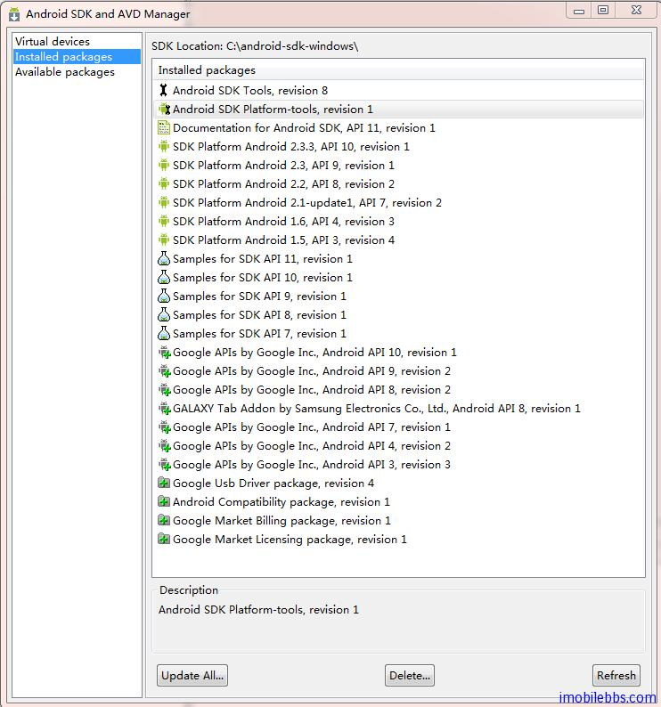
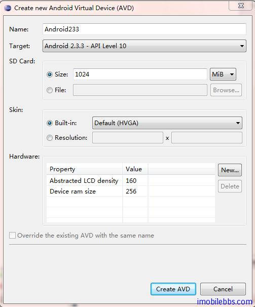

# 安装开发环境

前面 [Android 简明开发教程一：概述](http://www.imobilebbs.com/wordpress/?p=757)简要的介绍了 Android 平台，本篇说明如何安装搭建 [Android开发环境](http://developer.android.com/sdk/installing.html)。

Android 开发支持 Windows （Windows XP (32-bit), Vista (32- , 64-bit),  Windows 7 (32- , 64-bit)），Mac OS （>10.5.8)，Linux( Ubuntu Linux, Lucid Lynx etc). 开发Java 应用最常用的是 NetBean 和 Eclispe。但 Google 推荐使用的是 Eclipse。虽然也有支持Android 的 Netbean 插件，但兼容性不是很好。所以最好还是使用 Eclipse。

1. 安装最新版 JDK ，只有 JRE（Java 运行时）是不够的。
2. 下载 Eclipse 3.3 (Europa), 3.4 (Ganymede)
3. 下载最新版 Android SDK
4. 下载最新版 Eclipse ADT 插件
5. 添加 Android 平台和其它组件。安装 ADT 插件后，在 Eclipse 的 Windows 菜单下选择Android SDK and AVD Manager。     

在 Avaiable Packages 选择你想安装支持的 Android 平台和一些工具，如果你的硬盘足够大，简单的方法是全部选中，另外，尽管开发 Android 应用可以使用模拟器，但最终测试还是要在手机上进行，为了能够在设备上运行调试，请确保选中 Google Usb Driver Package。也可以在需要时再安装，Android SDK and AVD Manager 可以运行多次更新。
6. 创建模拟器 ，在 Virtual Devices 下可以管理 Android 模拟器

创建模拟器时指定目标 Android 平台的版本，目前市面上 Android 的版本从1.5到2.3多有，一般来说高版本向下兼容低版本。可以为不同的 Android 平台版本都创建一个虚拟机，建议创建两个以上，这样对于测试 SMS，Phone Call 等应用就比较方便。

Tags: [Android](http://www.imobilebbs.com/wordpress/archives/tag/android)