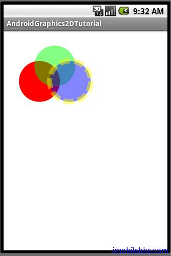

# 引路蜂二维图形绘制实例功能定义

有了前面对 Android 平台的介绍，基本上可以开始编写 Android 应用了，这里将以绘制二维图形为例，对 Android 开发的一般方法做过介绍，其中涉及到自定义 Application 类，扩展 View，Intent 定义，发送消息，Data Binding（Adapter），和基本 UI 设计。示例没有使用 Android 平台自带的二维图形 API，而是调用了引路蜂二维图形库，引路蜂二维图形库 Graphics 2D API 实现了移动平台上图形引擎,它能够以一种统一的方式处理各种基本图形(Shape),路径(Path),文本(Texts),适量字体及图像。基本类定义类同 Windows GDI+库。
所有示例和 Silverlight 二维图形库类似 Silverlight 引路蜂二维图形库下载
实例将提供源码，内含引路蜂二维图形库（免费使用）。

二维图形按功能分成下表所示：

|功能|	示例|
|:------|:------|
|Color|	Colors|
|Brush|	Pattern ，Gradients|
|Pen	|Lines, Dashes, LineCap,LineJoin|
|Path	|Polys, Paths|
|Shape	|Oval ,Pear ,Shape2DDemo|
|Image|	DrawMap, JumbleImage, SeeThroughImage|
|Font|	FontDemo, FontTypes|
|Transform|	Transform|
|Dynamic Shape|	Bezier|

每个功能设计成一个 Activity，包含在 AndroidGraphics2DApplication 中。

Tags: [Android](http://www.imobilebbs.com/wordpress/archives/tag/android)