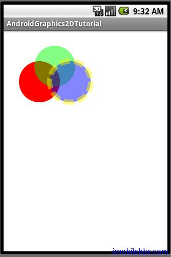

# 引路蜂二维图形库简介及颜色示例

AndroidGraphics2DTutorial 定义了应用的主 Activity，下面就可以开始写每个具体的二维绘图示例。不同的例子将尽量采用不同的 UI 控件：Menu，Content Menu，Dialog，Custom Dialog，Button 等等。例子采用了引路蜂二维图形库，引路蜂二维图形库 Graphics 2D API 实现了移动平台(Java ME,Blackberry,iPhone,Android,Windows Phone)上图形引擎,它能够以一种统一的方式处理各种基本图形(Shape),路径(Path),文本(Texts),适量字体及图像。 简单的说来，Graphics 2D API 实现了与之对应的 Java SE 上类似的二维图形库 API。

主要功能如下：
- 支持各种基本图形：曲线，矩形，椭圆等；
- 支持绘制任意几何图形
- 支持在图形，文体，图象上的碰撞检测
- 增强的颜色扶持及颜色管理
- 控制图形绘制的质量
- 填充，外框，各种线条绘制
- 二维图形变换
- 矢量字体
- 从左到右，从右到左，从上到下显示文体
- 反走样
- 透明度支持
- 图标，及图象绘制

详细的内容可以参见 [Silverlight 引路蜂二维图形库示例](http://www.imobilebbs.com/wordpress/?p=564)

我们在 [Android简明开发教程九：创建应用程序框架](http://www.imobilebbs.com/wordpress/?p=896)中定义了一个基类 Graphics2DActivity 作为所有示例Activity的父类：

```
public abstract class Graphics2DActivity extends Activity{

 protected Graphics2D graphics2D
    =SharedGraphics2DInstance.graphics2d;
 
 public void onCreate(Bundle savedInstanceState) {
  super.onCreate(savedInstanceState);
  setContentView(R.layout.main);
 }
 
 protected abstract void drawImage();

 public void onStart() {
  super.onStart();
  drawImage();

 }
}
```

其中 graphics2D 为图形画板对象(Canvas)是以 width  x height 的二维整型数组来表示的。这个数组的每个值为一个32为整数。格式为 ARGB，分别代表透明度，红色，绿色，蓝色。在画板上的绘制操作（点，线，多边形，填充等）是修改这些颜色值。

R.layout.main 中可以使用 GuidebeeGraphics2DSurfaceView 或是 GuidebeeGraphics2DView 来作为画板的显示结果。

抽象方法 protected abstract void drawImage()；用来绘制不同的内容。

修改 com.pstreets.graphics2d.example.Colors 来使用引路蜂二维图形库绘制不同的颜色，如果以前用过 Java  SE或是 .Net Framework,你会觉得引路蜂二维图形库提供的API和它们非常相似，代码很好理解。

```
public class Colors extends Graphics2DActivity{
 
 protected void drawImage(){
  
      /**
      * The solid (full opaque) red color in the ARGB space
      */
     Color redColor    = new Color(0xffff0000);

     /**
      * The semi-opaque green color in the ARGB space (alpha is 0x78)
      */
     Color greenColor = new Color(0x7800ff00,true);

     /**
      * The semi-opaque blue color in the ARGB space (alpha is 0x78)
      */
     Color blueColor = new Color(0x780000ff,true);
     /**
      * The semi-opaque yellow color in the ARGB space ( alpha is 0x78)
      */
     Color yellowColor = new Color(0x78ffff00,true);

     /**
      * The dash array
      */
     int dashArray[] = { 20 ,8 };
     graphics2D.clear(Color.WHITE);
     SolidBrush brush=new SolidBrush(redColor);
     graphics2D.fillOval(brush,30,60,80,80);
     brush=new SolidBrush(greenColor);
     graphics2D.fillOval(brush,60,30,80,80);
     Pen pen=new Pen(yellowColor,10,Pen.CAP_BUTT,Pen.JOIN_MITER,dashArray,0);
     brush=new SolidBrush(blueColor);
     graphics2D.setPenAndBrush(pen,brush);
     graphics2D.fillOval(null,90,60,80,80);
     graphics2D.drawOval(null,90,60,80,80);
    
 }

}
```



Colors  Activity 非常简单，除 View 之外，没有其它 UI。 按“Back”后可以退回示例列表显示UI。

Tags: [Android](http://www.imobilebbs.com/wordpress/archives/tag/android)
