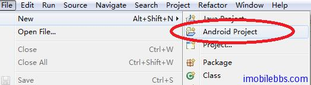
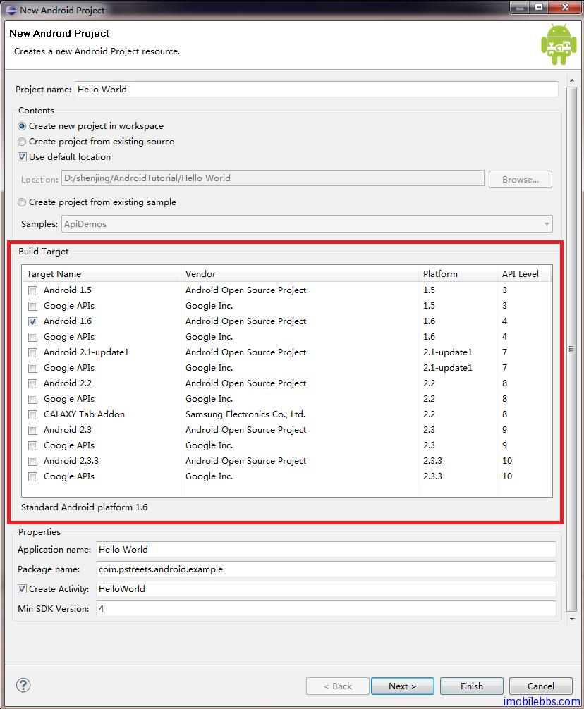
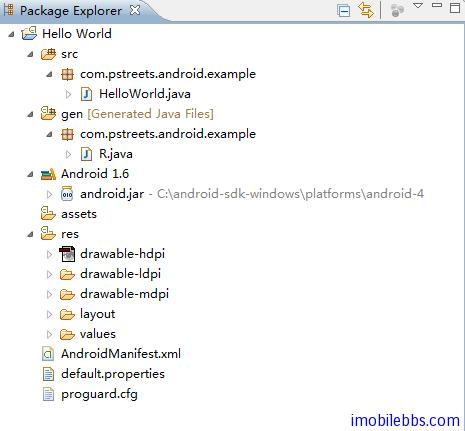
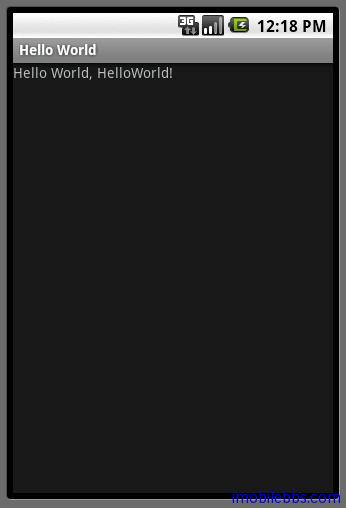

# 第一个应用 Hello World

在安装后 Android 开发环境和创建好 Android 模拟器之后，就可以开始写第一个 Android 应用“Hello,World”。后面的例子均采用 Eclipse IDE。
安装 ADT plugin 之后，创建的新项目种类就会增加一个 Android Project 类型：



选择 Android Project 项目类型，出现下面对话框：



Project Name ： Hello World  
Build Target： 这里选择 Android 1.6 ，如果你的 Build Target 列表为空，则表示你忘记设置Android SDK 安装目录了。可以通过 Windows -> Preferences -> Android 来设置 SDK 路径。     
Application Name: Hello World   
Package name: com.pstreets.android.example, 如果您开发过 Java 或是 .Net Framework 应用，包名称并不陌生。   
Create Activity： HelloWorld。 Activity 是 Android 平台中特有的一个新概念。以 Java ME或是 Windows Mobile CE 应用作参考，它类似于 Java ME 和 Windows Mobile 中 UI 类的 Form类。   
Min SDK Version: 可以为空。 Android 平台的版本比较多，从1.5到目前的3.0。Android 平台支持向下兼容。Min SDK Version指出了您开发应用支持的最第版本。4对应于 Android 1.5。

点击“Finish”则在 Eclipse 的 Workspace 中创建了“Hello World”项目：



ADT Plug 自动创建了几个目录：

src  应用源码目录  
gen  Android 应用自动生成的代码，主要是根据 Android 资源目录 res 下的资源来生成的，这样可以根据资源 ID 来访问应用中的资源。一般不建议手工改动，即使改动，下次编译时也会被重新覆盖。   
Android 1.6 表示当前选择的 Android 版本是 Android 1.6，你可以使用 Android 1.6 中提供的API。可以通过项目的属性来修改 Android 版本。    
assets  静态文件目录。Hello world 中为空。   
res 为应用中的资源目录，res 中含有多个子目录，为多种资源。如果你曾经使用 Silverlight, Polish Java ME 或是 WPF 等使用 XML 来描述 UI 的应用，则您会觉得 res 目录下的各种资源文件似曾相识。Android 也是采用 XML 来描述 UI 的。   
AndroidManifest.xml 应用程序描述文件，类同于 Java ME 的 JAD 文件。它定义了应用的构成，组件，权限等信息。   
default.properties 和 proguard.cfg 一般不需要改动。proguard.cfg 主要用来扰码(混淆器）来保护应用防止反编译。开发过 Java 或是 .Net 应用的应该对这比较熟悉。   

这样就有了第一个应用“Hello World”,可以直接运行。Run As -> Android Application ，将启动模拟器，如果你有 Android 设备，则也可以选择使用 Android 设备运行。



到目前为止我们还没有写一行代码。还不能说了解开发 Android 应用的基本概念。所以需要具体了解一下这个应用的几个重要的组成部分：

主 Activity ，打开类 com.pstreets.android.example.HelloWorld

```
package com.pstreets.android.example;  

import android.app.Activity;
import android.os.Bundle;  

public class HelloWorld extends Activity {
    /** Called when the activity is first created. */
    @Override
    public void onCreate(Bundle savedInstanceState) {
        super.onCreate(savedInstanceState);
        setContentView(R.layout.main);
    }
}
```

前面提到 Activity 是 Android 中类似 Windows Mobile 中的 Form 类的基本 UI 类。如果您开发过 Java ME 应用，Activity 更像 MIDlet，当 Android 应用可以有多个Activity，而每个Java ME应用中只能有一个MIDlet派生类。如果熟悉MVC ，MVP模型 ，Activity类似于 MVC或是 MVP模型中的 Controller或是Presenter。Activity 有多个生命周期事件可以实现，onCreate是其中一个，它类似于Java ME MIDlet的 startApp 或是 From 的 From_Load事件。Activity将在后面在详细介绍。 setContentView(R.layout.main); 设置Activity主用户UI。

Layout 资源文件  res->layout->main.xml

```
<?xml version=”1.0″ encoding=”utf-8″?>
<LinearLayout xmlns:android=”http://schemas.android.com/apk/res/android”
    android:orientation=”vertical”
    android:layout_width=”fill_parent”
    android:layout_height=”fill_parent”
    >
<TextView 
    android:layout_width=”fill_parent”
    android:layout_height=”wrap_content”
    android:text=”@string/hello”
    />
</LinearLayout>
```

Android 是通过 XML 来描述 UI 的，UI 一般通过 res 下 Layout 资源来描述 main.xml 中定义了 HelloWorld主 界面。可以看到 LinearLayout 和 TextView 两个元素。这表示主界面采用LinearLayout 布局（类似 Swing 中 Layout），下面是一个 TextView（文本框），文本框显示的内容是@string/hello， @string/hello 为一个 string 资源，@表示资源引用。string 资源定义在 res->values->strings.xml 中，其值为<string name=”hello”>Hello World, HelloWorld!</string>。

View 在 Android 中表示一个可视化组件，刚接触 Android 开发时，可能会有些困惑，因为在其它平台在 View 一般指用户界面（Windows），如果拿 Java ME 或是 Windows Mobile 做类比的话，Android 中的 View 相当于 Windows Mobile 中的 Control 或是 Component， ViewGroup 相当于 Container 或是 Swing 中的 Layout。  R.layout.main 定义在 gen->R.Java 中，为自动为资源生成的资源 ID。

AndroidManifest.xml 应用程序清单

```
<?xml version=”1.0″ encoding=”utf-8″?>
<manifest xmlns:android=”http://schemas.android.com/apk/res/android”
      package=”com.pstreets.android.example”
      android:versionCode=”1″
      android:versionName=”1.0″>
    <application android:icon=”@drawable/icon” android:label=”@string/app_name”>
        <activity android:name=”.HelloWorld”
                  android:label=”@string/app_name”>
            <intent-filter>
                <action android:name=”android.intent.action.MAIN” />
                <category android:name=”android.intent.category.LAUNCHER” />
            </intent-filter>
        </activity>

    </application>
    <uses-sdk android:minSdkVersion=”4″ />

</manifest>
```

和 Java ME 的 JAD 文件类似，AndroidManifest.xml 定义了 Android 应用中所有的Activity ，应用的图标，权限等属性。

```
<intent-filter>
 <action android:name=”android.intent.action.MAIN” />
 <category android:name=”android.intent.category.LAUNCHER” />
```

</intent-filter> 表示这个 Activity 是可以通过 Android 应用菜单来启动，具体含义在介绍Activity时再说明。

此外,Android 除了使用 XML 来描述 UI 外，如果你不怕麻烦的话，也可以通过代码来创建 UI，方法类似 Swing UI。

Tags: [Android](http://www.imobilebbs.com/wordpress/archives/tag/android)