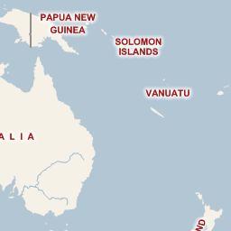
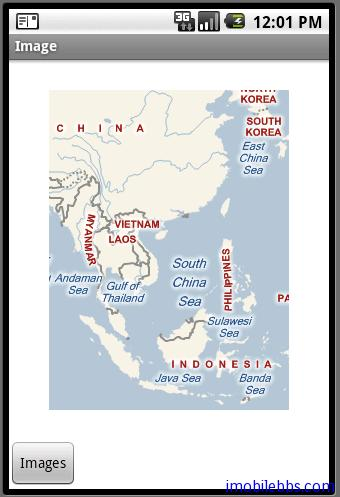

# 訪問 Internet 繪製在線地圖

在例子 [Android 簡明開發教程十七：Dialog 顯示圖像](http://www.imobilebbs.com/wordpress/?p=955)中我們留了一個例子 DrawMap()沒有實現，這個例子顯示在線地圖，目前大部分地圖伺服器都是將地圖以圖片存儲以提高響應速度。 一般大小為256X256個像素。具體可以參見[離線地圖下載方法解析](http://www.imobilebbs.com/wordpress/?p=763)。

比如： [URL http://www.mapdigit.com/guidebeemap/maptile.php?type=MICROSOFTMAP&x=7&y=4&z=14](http://www.mapdigit.com/guidebeemap/maptile.php?type=MICROSOFTMAP&x=7&y=4&z=14)顯示：



下面的例子訪問 Internet 下載地圖圖片，並拼接成地圖顯示,這種方法也是引路蜂地圖開發包實現的一個基本原則。

Android 應用訪問 Internet，首先需要賦予應用有訪問 Internet 的許可權：在AndroidManifest.xml 中添加：

<uses-permission android:name=”android.permission.INTERNET” />

然後實現 DrawMap()如下：

```
private void drawMap(){
 try{

 graphics2D.clear(Color.WHITE);
 graphics2D.Reset();
 for(int x=6;x<8;x++)
 {
 for(int y=3;y<5;y++){
 String urlString="http://www.mapdigit.com/guidebeemap";
 urlString+="/maptile.php?type=MICROSOFTMAP";
 urlString+="&x="+x+"&y="+y+"&z=14";
 URL url=new URL(urlString);
 URLConnection connection=url.openConnection();
 HttpURLConnection httpConnection=(HttpURLConnection)connection;
 int responseCode=httpConnection.getResponseCode();
 if(responseCode==HttpURLConnection.HTTP_OK){
 InputStream stream=httpConnection.getInputStream();
 Bitmap bitmap=BitmapFactory.decodeStream(stream);
 int []buffer=new int[bitmap.getHeight()
 * bitmap.getWidth()];
 bitmap.getPixels(buffer, 0, bitmap.getWidth(), 0, 0,
 bitmap.getWidth(), bitmap.getHeight());
 graphics2D.drawImage(buffer,bitmap.getWidth(),
 bitmap.getHeight(),(x-6)*256,(y-3)*256);

 }
 }
 }
 graphic2dView.refreshCanvas();

 }catch(Exception e){

 }
}
```

Android 中訪問 Internet 類主要定義在 java.net.* 和 android.net.*包中。上面顯示結果如下：



地圖沒有顯示滿屏是因為 Graphics2D 創建的 Canvas 大小沒有創建滿屏，創建的大小是240X320，如果創建滿屏的，則可以滿屏顯示地圖。

Tags: [Android](http://www.imobilebbs.com/wordpress/archives/tag/android)
