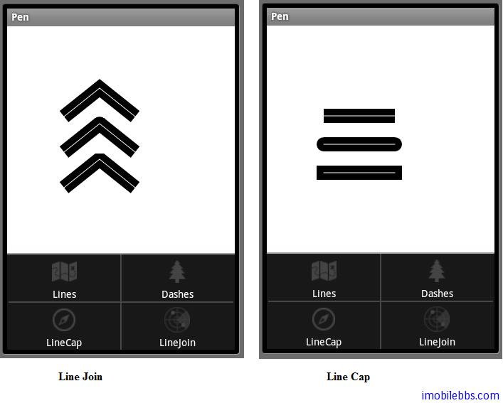

# Option Menu 画笔示例

引路蜂二维图形画笔（Pen）示例含有四个示例，Lines ，Dashes ,LineJoin 和 LineCap。打算采用Option Menu（主菜单）的方式来选择不同示例。

首先要对 GuidebeeGraphics2DView，和 Graphics2DActivity做些改动，从这个示例开始，GuidebeeGraphics2DView 需要动态绘制不同图形（可以通过菜单，或是 Thread）。在GuidebeeGraphics2DView 增加下面两个方法：

```
final Runnable updateCanvas = new Runnable() {
 public void run() {
  invalidate();
 }
};

public void refreshCanvas(){
 post(updateCanvas);
}
```

post 可以用在非 UI Thread 中 Call UI Thread 中方法。这里只是触发屏幕重绘事件以刷新屏幕显示。

在 Graphics2DActivity 增加一个变量 protected GuidebeeGraphics2DView graphic2dView; 来获得对应的 GuidebeeGraphics2DView 实例。

graphic2dView=(GuidebeeGraphics2DView)findViewById(R.id.graphics2dview);

使用 Option Menu，尽管也可以完全使用代码来创建菜单，更一般的方法是使用菜单资源。在 res 下创建 menu 子目录，然后在 res\menu 下创建 menu_option_line.xml 用来显示 Pen 的四个示例选项：

```
<?xml version=”1.0″ encoding=”utf-8″?>
<menu
  xmlns:android=”[http://schemas.android.com/apk/res/android](http://schemas.android.com/apk/res/android)“>
<item
 android:id=”@+id/mnuLines”
 android:title=”Lines”
 android:icon=”@drawable/icon1″>
</item>
<item
 android:id=”@+id/mnuDashes”
 android:title=”Dashes”
 android:icon=”@drawable/icon2″>
</item>
<item
 android:id=”@+id/mnuLineCap”
 android:title=”LineCap”
 android:icon=”@drawable/icon3″>
</item>
<item
 android:id=”@+id/mnuLineJoin”
 android:title=”LineJoin”
 android:icon=”@drawable/icon4″>
</item>
</menu>
```

<menu></menu> 定义菜单，<item></item>定义菜单项，<item></item>可以嵌套以定义子菜单。菜单可以定义 id, Icon,Text 等属性。也可以支持单选，多选，此时就需要借助<group></group>,使用 group 可以把一最菜单项定义为一个组，可以使用 setGroupVisible()来显示隐藏整个菜单组，Enable 或是 Disable 整个菜单组 setGroupEnabled()等。最关键的，有了组才能实现菜单的单选和多选功能：

```
<?xml version=”1.0″ encoding=”utf-8″?>
<menu xmlns:android=”[http://schemas.android.com/apk/res/android](http://schemas.android.com/apk/res/android)“>   
 <item android:id=”@+id/item1″         
 android:icon=”@drawable/item1″         
 android:title=”@string/item1″ />   
 <!– menu group –>   
 <group android:id=”@+id/group1″>       
  <item android:id=”@+id/groupItem1″             
  android:title=”@string/groupItem1″ />       
  <item android:id=”@+id/groupItem2″             
  android:title=”@string/groupItem2″ />   
 </group>
</menu>
```

定义好菜单资源后，就可以使用 MenuInflater.inflate()展开菜单，一般需要在 Activity 的onCreateOptionsMenu()展开菜单：

```
@Override
public boolean onCreateOptionsMenu(Menu menu) {
 MenuInflater inflater = getMenuInflater();
 inflater.inflate(R.menu.menu_option_line, menu);
 return true;
}
```

最后是响应菜单事件：

```
@Override
public boolean onOptionsItemSelected(MenuItem item) {
 menuOption = item.getItemId();
 drawImage();
 return true;
}
```

item.getItemId(); 返回菜单的 ID（在菜单资源中定义）。



完整代码如下：

```
public class Pen extends Graphics2DActivity {

 int menuOption;

 @Override
 protected void drawImage() {
  switch (menuOption) {
  case R.id.mnuLines:
   drawLines();
   break;

  case R.id.mnuDashes:
   drawDash();
   break;

  case R.id.mnuLineCap:
   drawLineCap();
   break;

  case R.id.mnuLineJoin:
   drawLineJoin();
   break;
  default:
   drawLines();
   break;

  }
  graphic2dView.refreshCanvas();

 }

 @Override
 public boolean onCreateOptionsMenu(Menu menu) {
  MenuInflater inflater = getMenuInflater();
  inflater.inflate(R.menu.menu_option_line, menu);
  return true;
 }

 @Override
 public boolean onOptionsItemSelected(MenuItem item) {
  menuOption = item.getItemId();
  drawImage();
  return true;
 }

 private void drawLineJoin() {
  Color blackColor = new Color(0xff000000);
  Color whiteColor = new Color(0xffffffff);

  com.mapdigit.drawing.geometry.Path path
    = new com.mapdigit.drawing.geometry.Path();
  path.moveTo(40, 60);
  path.lineTo(90, 20);
  path.lineTo(140, 60);
  // Clear the canvas with white color.
  graphics2D.clear(Color.WHITE);

  AffineTransform matrix = new AffineTransform();
  graphics2D.setAffineTransform(matrix);
  com.mapdigit.drawing.Pen pen
     = new com.mapdigit.drawing.Pen(blackColor,
    20, com.mapdigit.drawing.Pen.CAP_BUTT,
    com.mapdigit.drawing.Pen.JOIN_MITER);
  graphics2D.draw(pen, path);
  pen = new com.mapdigit.drawing.Pen(whiteColor, 1);
  graphics2D.draw(pen, path);

  matrix.translate(0, 50);
  graphics2D.setAffineTransform(matrix);

  pen = new com.mapdigit.drawing.Pen(blackColor, 20,
    com.mapdigit.drawing.Pen.CAP_BUTT,
    com.mapdigit.drawing.Pen.JOIN_ROUND);
  graphics2D.draw(pen, path);
  pen = new com.mapdigit.drawing.Pen(whiteColor, 1);
  graphics2D.draw(pen, path);

  matrix = new AffineTransform();
  matrix.translate(0, 100);
  graphics2D.setAffineTransform(matrix);

  pen = new com.mapdigit.drawing.Pen(blackColor, 20,
    com.mapdigit.drawing.Pen.CAP_BUTT,
    com.mapdigit.drawing.Pen.JOIN_BEVEL);
  graphics2D.draw(pen, path);
  pen = new com.mapdigit.drawing.Pen(whiteColor, 1);
  graphics2D.draw(pen, path);

 }

 private void drawLineCap() {
  Color blackColor = new Color(0xff000000);
  Color whiteColor = new Color(0xffffffff);
  // Clear the canvas with white color.
  graphics2D.clear(Color.WHITE);
  AffineTransform matrix = new AffineTransform();
  graphics2D.setAffineTransform(matrix);

  com.mapdigit.drawing.Pen pen
      = new com.mapdigit.drawing.Pen(blackColor,
    20, com.mapdigit.drawing.Pen.CAP_BUTT,
    com.mapdigit.drawing.Pen.JOIN_MITER);
  graphics2D.drawLine(pen, 40, 60, 140, 60);
  pen = new com.mapdigit.drawing.Pen(whiteColor, 1);
  graphics2D.drawLine(pen, 40, 60, 140, 60);

  pen = new com.mapdigit.drawing.Pen(blackColor, 20,
    com.mapdigit.drawing.Pen.CAP_ROUND,
    com.mapdigit.drawing.Pen.JOIN_MITER);
  graphics2D.drawLine(pen, 40, 100, 140, 100);
  pen = new com.mapdigit.drawing.Pen(whiteColor, 1);
  graphics2D.drawLine(pen, 40, 100, 140, 100);

  pen = new com.mapdigit.drawing.Pen(blackColor, 20,
    com.mapdigit.drawing.Pen.CAP_SQUARE,
    com.mapdigit.drawing.Pen.JOIN_MITER);
  graphics2D.drawLine(pen, 40, 140, 140, 140);
  pen = new com.mapdigit.drawing.Pen(whiteColor, 1);
  graphics2D.drawLine(pen, 40, 140, 140, 140);
 }

 private void drawLines() {
  Color greenColor = new Color(0xff00ff00);
  // Clear the canvas with white color.
  graphics2D.clear(Color.WHITE);
  AffineTransform matrix = new AffineTransform();
  graphics2D.setAffineTransform(matrix);

  com.mapdigit.drawing.Pen pen
    = new com.mapdigit.drawing.Pen(greenColor,1);
  graphics2D.drawLine(pen, 20, 150, 60, 50);

  pen = new com.mapdigit.drawing.Pen(greenColor, 2);
  graphics2D.drawLine(pen, 40, 150, 80, 50);

  pen = new com.mapdigit.drawing.Pen(greenColor, 3);
  graphics2D.drawLine(pen, 60, 150, 100, 50);

  pen = new com.mapdigit.drawing.Pen(greenColor, 5);
  graphics2D.drawLine(pen, 80, 150, 120, 50);

  pen = new com.mapdigit.drawing.Pen(greenColor, 7);
  graphics2D.drawLine(pen, 100, 150, 140, 50);

  pen = new com.mapdigit.drawing.Pen(greenColor, 10);
  graphics2D.drawLine(pen, 120, 150, 160, 50);

 }

 private void drawDash() {
  Color blackColor = new Color(0xff000000);
  int dashArray1[] = { 2, 2 };
  int dashArray2[] = { 6, 6 };
  int dashArray3[] = { 4, 1, 2, 1, 1, 6 };
  // Clear the canvas with white color.
  graphics2D.clear(Color.WHITE);
  AffineTransform matrix = new AffineTransform();
  graphics2D.setAffineTransform(matrix);

  com.mapdigit.drawing.Pen pen
      = new com.mapdigit.drawing.Pen(blackColor,
    20, com.mapdigit.drawing.Pen.CAP_BUTT,
    com.mapdigit.drawing.Pen.JOIN_MITER, dashArray1, 0);
  graphics2D.drawLine(pen, 40, 60, 140, 60);

  pen = new com.mapdigit.drawing.Pen(blackColor, 20,
    com.mapdigit.drawing.Pen.CAP_BUTT,
    com.mapdigit.drawing.Pen.JOIN_MITER, dashArray2, 0);
  graphics2D.drawLine(pen, 40, 100, 140, 100);

  pen = new com.mapdigit.drawing.Pen(blackColor, 20,
    com.mapdigit.drawing.Pen.CAP_BUTT,
    com.mapdigit.drawing.Pen.JOIN_MITER, dashArray3, 0);
  graphics2D.drawLine(pen, 40, 140, 140, 140);
 }
}

```

Tags: [Android](http://www.imobilebbs.com/wordpress/archives/tag/android)
