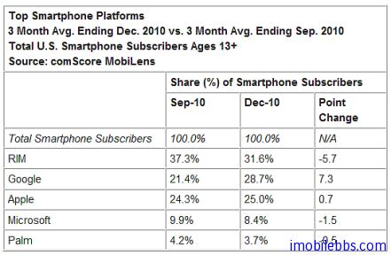
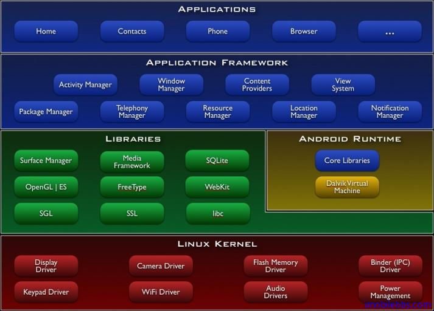

# 概述

自 Google 推出 Android 手机平台以来，采用 Android 作为平台的手机和平板电脑越来越普及。下图是2010年9月和12月三个月几个主流智能手机平台在美国的市场占有率图表。

可以看到到2010年12月，Android 市场占有率在美国已超过 Apple 的 iPhone，而且由于 Android平台的开放性，个人认为将来它会更加普及。相当于其它常见的手机开发平台，如 Java ME，Windows Mobile ，BlackBerry， iPhone ,Winodws Phone 7。 Android 开发还是比较容易上手的。

## 什么是 Android？

Android 是一个专门针对移动设备的软件集，它包括一个操作系统，中间件和一些重要的应用程序。Android SDK 提供了在 Android 平台上使用 JaVa 语言进行 Android 应用开发必须的工具和 API 接口。

## Android 特性

- 应用程序框架支持组件的重用与替换
- Dalvik 虚拟机专为移动设备优化
- 集成的浏览器基于开源的WebKit 引擎
- 优化的图形库包括定制的 2D 图形库，3D 图形库基于 OpenGL ES 1.0（硬件加速可选）
- SQLite 用作结构化的数据存储
- 多媒体支持包括常见的音频、视频和静态图像格式（如 MPEG4, H.264, MP3, AAC, AMR, JPG, PNG,GIF）
- GSM 电话技术（依赖于硬件）
- 蓝牙 Bluetooth, EDGE, 3G,和 WiFi（依赖于硬件）
- 照相机，GPS，指南针，和加速度计（accelerometer） （依赖于硬件）
- 丰富的开发环境包括设备模拟器，调试工具，内存及性能分析图表，和 Eclipse 集成开发环境插件。

## 应用程序框架

开发人员也可以完全访问核心应用程序所使用的 API 框架。该应用程序的架构设计简化了组件的重用；任何一个应用程序都可以发布它的功能块并且任何其它的应用程序都可以使用其所发布的功能块（不过得遵循框架的安全性限制）。同样，该应用程序重用机制也使用户可以方便的替换程序组件。
隐藏在每个应用后面的是一系列的服务和系统, 其中包括；

- 丰富而又可扩展的视图（Views），可以用来构建应用程序， 它包括列表（lists），网格（grids）， 文本框（text boxes），按钮（buttons）， 甚至可嵌入的 web 浏览器。
- 内容提供器（Content Providers）使得应用程序可以访问另一个应用程序的数据（如联系人数据库）， 或者共享它们自己的数据
- 资源管理器（Resource Manager）提供非代码资源的访问，如本地字符串，图形，和布局文件（layoutfiles）。
- 通知管理器（Notification Manager） 使得应用程序可以在状态栏中显示自定义的提示信息。
- 活动管理器（Activity Manager） 用来管理应用程序生命周期并提供常用的导航回退功能。

## 程序库

Android 包含一些 C/C++ 库，这些库能被 Android 系统中不同的组件使用。它们通过 Android 应用程序框架
为开发者提供服务。以下是一些核心库：

- 系统 C 库- 一个从 BSD 继承来的标准 C 系统函数库（libc）， 它是专门为基于 embedded linux 的设备定制的。
- 媒体库- 基于 PacketVideo OpenCORE；该库支持多种常用的音频、视频格式回放和录制，同时支持静态图像文件。编码格式包括 MPEG4, H.264, MP3, AAC, AMR, JPG, PNG 。
- SurfaceManager – 对显示子系统的管理，并且为多个应用程序提供了 2D 和 3D 图层的无缝融合。
- LibWebCore – 一个最新的 web 浏览器引擎用，支持 Android 浏览器和一个可嵌入的 web 视图。
- SGL – 底层的 2D 图形引擎
- 3D libraries – 基于 OpenGL ES 1.0 APIs 实现；该库可以使用硬件 3D 加速（如果可用）或者使用高度优化的 3D 软加速。
- FreeType -位图（bitmap）和矢量（vector）字体显示。
- SQLite – 一个对于所有应用程序可用，功能强劲的轻型关系型数据库引擎。

## Android 运行库

Android 包括了一个核心库，该核心库提供了 JAVA 编程语言核心库的大多数功能。
每一个Android 应用程序都在它自己的进程中运行，都拥有一个独立的 Dalvik 虚拟机实例。Dalvik 被设计成一个设备可以同时高效地运行多个虚拟系统。Dalvik 虚拟机执行（.dex）的 Dalvik 可执行文件，该格式文件针对小内存使用做了优化。同时虚拟机是基于寄存器的，所有的类都经由 JAVA 编译器编译，然后通过 SDK 中的”dx” 工具转化成 .dex 格式由虚拟机执行。
Dalvik 虚拟机依赖于 linux 内核的一些功能，比如线程机制和底层内存管理机制。

## Linux 内核

Android 的核心系统服务依赖于 Linux 2.6 内核，如安全性，内存管理，进程管理， 网络协议栈和驱动模型。
Linux 内核也同时作为硬件和软件栈之间的抽象层。

## Android 应用和框架

下图显示了 Android 系统的主要组成部分。

核心应用，例如联系人，电子邮件，电话，浏览器，日历，地图， …
充分访问所有核心应用框架 API
C/C++ 库：被各种 Android 组件使用通过应用程序框架开发者可以使用其功能包括：
媒体库：MPEG4 H.264 MP3 JPG PNG …..
WebKit/LibWebCore：Web 浏览引擎
SQLite 关系数据库引擎
2D，3D 图形库、引擎

Android 使用 Java 作为开发语言，而且有很大一部分库与 Java SE 共有，但不同于 Java ME，Dalvik 虚拟机也不是 Java 虚拟机。Eclipse 是 Android 推荐的开发 IDE，Android 平台自带的各种应用如联系人，电子邮件，电话，浏览器，日历，地图都可以重写。

Tags: [Android](http://www.imobilebbs.com/wordpress/archives/tag/android)
