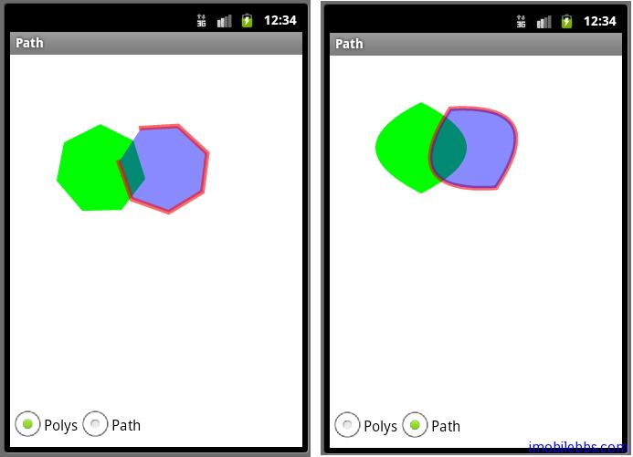

# RadioButton 多边形及路径绘制

这个例子是绘制多边形，多义形和路径，采用单选钮 RadioButton 来选择 Polys 和 Path 示例:

UI 设计为 上部分用来显示绘图内容，下部分为两个单选按钮 Polys ，Path。这样 layout 就和main.xml 不一样，main.xml 只含一个 com.pstreets.graphics2d.GuidebeeGraphics2DView。因此需在 res\layout 下新建一个 polys.xml：

```
<?xml version=”1.0″ encoding=”utf-8″?>
<LinearLayout xmlns:android=”[http://schemas.android.com/apk/res/android](http://schemas.android.com/apk/res/android)”
    android:orientation=”vertical”
    android:background=”@drawable/white”
 android:layout_width=”fill_parent”
 android:layout_height=”fill_parent”>
    <com.pstreets.graphics2d.GuidebeeGraphics2DView
     android:id=”@+id/graphics2dview”
     android:layout_weight=”1″
     android:layout_width=”fill_parent”
     android:layout_height=”wrap_content”/>
 <LinearLayout xmlns:android=”[http://schemas.android.com/apk/res/android](http://schemas.android.com/apk/res/android)”
  android:layout_width=”wrap_content” android:layout_height=”wrap_content”
  android:orientation=”horizontal”
  
```

```
>
  <RadioGroup
     android:layout_width=”wrap_content”
     android:orientation=”horizontal”
     android:textSize=”20dp”
     android:layout_height=”wrap_content”>
   <RadioButton android:text=”Polys”
       android:id=”@+id/radioPolys”
    android:layout_width=”wrap_content”
    android:textColor=”@color/black”
    android:checked=”true”
    android:layout_height=”wrap_content”>
   </RadioButton>
   <RadioButton android:text=”Path”
        android:id=”@+id/radioPath”
    android:layout_width=”wrap_content”
    android:textColor=”@color/black”
    android:layout_height=”wrap_content”>
   </RadioButton>
  </RadioGroup>
 </LinearLayout>

</LinearLayout>
```

RadioButton 需包含在 RadioGroup 中做为一个分组，这里将 Polys 设为选中。

定义好 Layout 资源后，修改 Path.java

```
private RadioButton radioPoly;
private RadioButton radioPath;

public void onCreate(Bundle savedInstanceState) {
 super.onCreate(savedInstanceState);
 setContentView(R.layout.polys);
 graphic2dView
  = (GuidebeeGraphics2DView)
    findViewById(R.id.graphics2dview);
 radioPath = (RadioButton) findViewById(R.id.radioPath);
 radioPoly = (RadioButton) findViewById(R.id.radioPolys);
 radioPath.setOnClickListener(this);
 radioPoly.setOnClickListener(this);
}
```

应为需要处理按键消息，所以定义了两个 RadioButton 对象，可以通过 findViewById 获取实例。因为两个 RadioButton 这里采用同样的处理方法，可以让 Path 实现 OnClickListener ，即：public class Path extends Graphics2DActivity   implements OnClickListener。完整代码如下：

```
public class Path extends Graphics2DActivity 
   implements OnClickListener {

	private RadioButton radioPoly;
	private RadioButton radioPath;

	public void onCreate(Bundle savedInstanceState) {
		super.onCreate(savedInstanceState);
		setContentView(R.layout.polys);
		graphic2dView 
		 = (GuidebeeGraphics2DView) 
		   findViewById(R.id.graphics2dview);
		radioPath = (RadioButton) findViewById(R.id.radioPath);
		radioPoly = (RadioButton) findViewById(R.id.radioPolys);
		radioPath.setOnClickListener(this);
		radioPoly.setOnClickListener(this);
	}

	@Override
	protected void drawImage() {
		if (radioPoly.isChecked()) {
			drawPolys();
		} else {
			drawPaths();
		}
		graphic2dView.refreshCanvas();

	}

	@Override
	public void onClick(View view) {
		drawImage();
	}

	private void drawPaths() {
		AffineTransform mat1;

		// The path. 
		com.mapdigit.drawing.geometry.Path path;

		// Colors 
		Color redColor = new Color(0x96ff0000, true);
		Color greenColor = new Color(0xff00ff00);
		Color blueColor = new Color(0x750000ff, true);

		String pathdata 
		   = "M 60 20 Q -40 70 60 120 Q 160 70 60 20 z";
		mat1 = new AffineTransform();
		mat1.translate(30, 40);
		mat1.rotate(-30 * Math.PI / 180.0);
		path = com.mapdigit.drawing.geometry.Path.fromString(pathdata);
		// Clear the canvas with white color.
		graphics2D.clear(Color.WHITE);

		graphics2D.setAffineTransform(new AffineTransform());
		SolidBrush brush = new SolidBrush(greenColor);
		graphics2D.fill(brush, path);
		graphics2D.setAffineTransform(mat1);

		brush = new SolidBrush(blueColor);
		com.mapdigit.drawing.Pen pen 
		   = new com.mapdigit.drawing.Pen(redColor, 5);
		graphics2D.setPenAndBrush(pen, brush);
		graphics2D.draw(null, path);
		graphics2D.fill(null, path);

	}

	private void drawPolys() {
		AffineTransform mat1;

		// Colors 
		Color redColor = new Color(0x96ff0000, true);
		Color greenColor = new Color(0xff00ff00);
		Color blueColor = new Color(0x750000ff, true);

		Polyline polyline;
		Polygon polygon;
		Polygon polygon1;

		String pointsdata1 
		= "59,45,95,63,108,105,82,139,39,140,11,107,19,65";
		mat1 = new AffineTransform();
		mat1.translate(30, 40);
		mat1.rotate(-30 * Math.PI / 180.0);
		polyline = new Polyline();
		polygon = new Polygon();
		polygon1 = new Polygon();
		Point[] points = Point.fromString(pointsdata1);
		for (int i = 0; i < points.length; i++) {
			polyline.addPoint(points[i].x, points[i].y);
			polygon.addPoint(points[i].x, points[i].y);
			polygon1.addPoint(points[i].x, points[i].y);
		}
		// Clear the canvas with white color.
		graphics2D.clear(Color.WHITE);

		graphics2D.setAffineTransform(new AffineTransform());
		SolidBrush brush = new SolidBrush(greenColor);
		graphics2D.fillPolygon(brush, polygon);
		graphics2D.setAffineTransform(mat1);

		brush = new SolidBrush(blueColor);
		com.mapdigit.drawing.Pen pen 
		   = new com.mapdigit.drawing.Pen(redColor, 5);
		graphics2D.setPenAndBrush(pen, brush);
		graphics2D.fillPolygon(null, polygon1);
		graphics2D.drawPolyline(null, polyline);

	}

}
```



Tags: [Android](http://www.imobilebbs.com/wordpress/archives/tag/android)