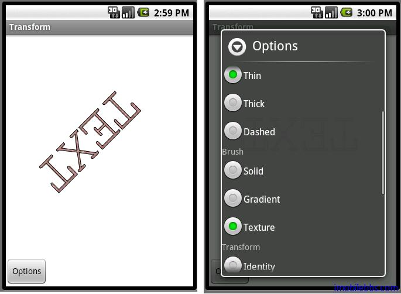

# 自定义对话框 Transform

Android 自带的 AlertDialog,ProgressDialog,DatePickerDialog,TimePickerDialog 可以用于简单的对话框显示。当还是有这些对话框不能满足应用需要的时候，这时就可以使用一些自定义的对话框。有多种方法可以实现自定义对话框。一是使用 Activity 作为 Dialog，可以通过设置 Activity 显示 Dialog 风格，使得该 Activity 在外观上和 Dialog 一致：显示在其它 Activity 前面且半透明。 

<Activity android:name=”MyDialogActivity” Android:theme=”@android:style/Theme.Dialog“></Activity> 

本例采用另外两种方法来使用自定义对话框,将用这个对话框来最为图形变换(Transform)的选项： 

Primitive: Rectange, Ellipse,Text  
Pen: Thin,Thick,Dashed  
Brush: Solid, Gradient,Texture  
Transform: Identity, Rotate, Scale, Shear  
Rendering: Stroke, Fill, Stoke and Fill   

首先在 res\layout 下新建 transformoption.xml 作为自定义对话框布局： 

```
<?xml version=”1.0″ encoding=”utf-8″?> 

<LinearLayout
  xmlns:android=”http://schemas.android.com/apk/res/android”
  android:layout_width=”fill_parent”
  android:layout_height=”fill_parent” 

  >
<ScrollView
  android:layout_width=”fill_parent”
  android:layout_height=”fill_parent”>
<LinearLayout
  android:layout_width=”fill_parent”
  android:layout_height=”fill_parent”
  android:orientation=”vertical”
  >
<TextView
   android:text=”Primitive”
   android:layout_width=”wrap_content”
   android:layout_height=”wrap_content”>
 </TextView>
 <RadioGroup
 android:layout_width=”wrap_content”
 android:layout_height=”wrap_content”> 

<RadioButton
android:text=”Rectangle”
android:id=”@+id/radioRectangle”
android:layout_width=”wrap_content”
android:layout_height=”wrap_content”>
</RadioButton>
<RadioButton
android:text=”Ellipse”
android:id=”@+id/radioEllipse”
android:layout_width=”wrap_content”
android:layout_height=”wrap_content”>
</RadioButton>
<RadioButton
android:text=”Text”
android:id=”@+id/radioText”
android:layout_width=”wrap_content”
android:layout_height=”wrap_content”>
</RadioButton>
 </RadioGroup> 

<TextView
   android:text=”Pen”
   android:layout_width=”wrap_content”
   android:layout_height=”wrap_content”>
 </TextView>
 <RadioGroup
 android:layout_width=”wrap_content”
 android:layout_height=”wrap_content”> 

<RadioButton
android:text=”Thin”
android:id=”@+id/radioThin”
android:layout_width=”wrap_content”
android:layout_height=”wrap_content”>
</RadioButton>
<RadioButton
android:text=”Thick”
android:id=”@+id/radioThick”
android:layout_width=”wrap_content”
android:layout_height=”wrap_content”>
</RadioButton>
<RadioButton
android:text=”Dashed”
android:id=”@+id/radioDashed”
android:layout_width=”wrap_content”
android:layout_height=”wrap_content”>
</RadioButton>
 </RadioGroup>
 
<TextView
   android:text=”Brush”
   android:layout_width=”wrap_content”
   android:layout_height=”wrap_content”>
 </TextView>
 <RadioGroup
 android:layout_width=”wrap_content”
 android:layout_height=”wrap_content”> 

<RadioButton
android:text=”Solid”
android:id=”@+id/radioSolid”
android:layout_width=”wrap_content”
android:layout_height=”wrap_content”>
</RadioButton>
<RadioButton
android:text=”Gradient”
android:id=”@+id/radioGradient”
android:layout_width=”wrap_content”
android:layout_height=”wrap_content”>
</RadioButton>
<RadioButton
android:text=”Texture”
android:id=”@+id/radioTexture”
android:layout_width=”wrap_content”
android:layout_height=”wrap_content”>
</RadioButton>
 </RadioGroup>
 
 <TextView
   android:text=”Transform”
   android:layout_width=”wrap_content”
   android:layout_height=”wrap_content”>
 </TextView>
 <RadioGroup
 android:layout_width=”wrap_content”
 android:layout_height=”wrap_content”> 

<RadioButton
android:text=”Identity”
android:id=”@+id/radioIdentity”
android:layout_width=”wrap_content”
android:layout_height=”wrap_content”>
</RadioButton>
<RadioButton
android:text=”Rotate”
android:id=”@+id/radioRotate”
android:layout_width=”wrap_content”
android:layout_height=”wrap_content”>
</RadioButton>
<RadioButton
android:text=”Scale”
android:id=”@+id/radioScale”
android:layout_width=”wrap_content”
android:layout_height=”wrap_content”>
</RadioButton>
<RadioButton
android:text=”Shear”
android:id=”@+id/radioShear”
android:layout_width=”wrap_content”
android:layout_height=”wrap_content”>
</RadioButton>
 </RadioGroup>
 
 <TextView
   android:text=”Rendering”
   android:layout_width=”wrap_content”
   android:layout_height=”wrap_content”>
 </TextView>
 <RadioGroup
 android:layout_width=”wrap_content”
 android:layout_height=”wrap_content”> 

<RadioButton
android:text=”Stroke”
android:id=”@+id/radioStroke”
android:layout_width=”wrap_content”
android:layout_height=”wrap_content”>
</RadioButton>
<RadioButton
android:text=”Fill”
android:id=”@+id/radioFill”
android:layout_width=”wrap_content”
android:layout_height=”wrap_content”>
</RadioButton>
<RadioButton
android:text=”Stroke and Fill”
android:id=”@+id/radioStrokeFill”
android:layout_width=”wrap_content”
android:layout_height=”wrap_content”>
</RadioButton>
 </RadioGroup>
 </LinearLayout>
</ScrollView>
</LinearLayout> 
```

 一种方法是重新定制 AlertDialog ，基本步骤和 Android 简明开发教程十七：Dialog 显示图像类似，但是在 protected Dialog onCreateDialog(int id) ，需要重新设定 Dialog 的 Content View 并给 RadioButton添加事件处理：

```
protected Dialog onCreateDialog(int id) {
 final Dialog dialog;
 switch (id) {
 case OPTION_DIALOG:
  LayoutInflater li
    = LayoutInflater.from(this);
  View optionView
    = li.inflate(R.layout.transformoption, null);
  AlertDialog.Builder optionDialog
    = new AlertDialog.Builder(this);
  optionDialog.setTitle("Options");
  optionDialog.setView(optionView);
  dialog = optionDialog.create();
  RadioButton button = (RadioButton) optionView
    .findViewById(R.id.radioRectangle);
  button.setOnClickListener(new Button.OnClickListener() { 

   public void onClick(View v) {
    primitiveIndex = PRIMITIVE_RECTANGLE;
    drawImage();
    dialog.dismiss(); 

   }
  });
  
  ... 

  button = (RadioButton) optionView
    .findViewById(R.id.radioStrokeFill);
  button.setOnClickListener(new Button.OnClickListener() { 

   public void onClick(View v) {
    renderingIndex = RENDERING_STROKE_AND_FILL;
    drawImage();
    dialog.dismiss(); 

   }
  });
  return dialog;
 } 

 return null; 

}
```

第二种是通过派生 Dialog ，定义了一个 OptionDialog 类作为 Dialog 子类。 

```
class OptionDialog extends Dialog { 

 public OptionDialog(Context context) {
  super(context);
  // TODO Auto-generated constructor stub
 }
  
 protected void onCreate(Bundle savedInstanceState) {
  super.onCreate(savedInstanceState);
  setContentView(R.layout.transformoption);
  setTitle("Options");
  RadioButton button
     = (RadioButton) findViewById(R.id.radioRectangle);
  button.setOnClickListener(new Button.OnClickListener() { 

   public void onClick(View v) {
    primitiveIndex = PRIMITIVE_RECTANGLE;
    drawImage();
    dismiss(); 

   }
  });
  ...
  button = (RadioButton) findViewById(R.id.radioStrokeFill);
  button.setOnClickListener(new Button.OnClickListener() { 

   public void onClick(View v) {
    renderingIndex = RENDERING_STROKE_AND_FILL;
    drawImage();
    dismiss(); 

   }
  });
 } 

}
```

这两种方法在显示 Dialog 时有所不同：

```
private OptionDialog optionDialog;
static final private int OPTION_DIALOG = 1;

...
optionDialog = new OptionDialog(this);

...
@Override
public void onClick(View view) {
 // optionDialog.show();
 showDialog(OPTION_DIALOG);

}
```

下面是完整代码： 

```
public class Transform extends Graphics2DActivity
  implements OnClickListener { 

 static int PRIMITIVE_RECTANGLE = 0;
 static int PRIMITIVE_ELLIPSE = 1;
 static int PRIMITIVE_TEXT = 2;
 static int PEN_THIN = 0;
 static int PEN_THICK = 1;
 static int PEN_DASHED = 2;
 static int BRUSH_SOLID = 0;
 static int BRUSH_GRADIENT = 1;
 static int BRUSH_TEXTURE = 2;
 static int TRANSFORM_IDENTITY = 0;
 static int TRANSFORM_ROTATE = 1;
 static int TRANSFORM_SCALE = 2;
 static int TRANSFORM_SHEAR = 3;
 static int RENDERING_STROKE = 0;
 static int RENDERING_FILL = 1;
 static int RENDERING_STROKE_AND_FILL = 2;
 int primitiveIndex;
 int penIndex;
 int brushIndex;
 int transformIndex;
 int renderingIndex;
 int[] rgbData;
 int bitmapWidth;
 int bitmapHeight; 

 class OptionDialog extends Dialog { 

  public OptionDialog(Context context) {
   super(context);
   // TODO Auto-generated constructor stub
  } 

  protected void onCreate(Bundle savedInstanceState) {
   super.onCreate(savedInstanceState);
   setContentView(R.layout.transformoption);
   setTitle("Options");
   RadioButton button
      = (RadioButton) findViewById(R.id.radioRectangle);
   button.setOnClickListener(new Button.OnClickListener() { 

    public void onClick(View v) {
     primitiveIndex = PRIMITIVE_RECTANGLE;
     drawImage();
     dismiss(); 

    }
   });
   button = (RadioButton) findViewById(R.id.radioEllipse);
   button.setOnClickListener(new Button.OnClickListener() { 

    public void onClick(View v) {
     primitiveIndex = PRIMITIVE_ELLIPSE;
     drawImage();
     dismiss(); 

    }
   });
   button = (RadioButton) findViewById(R.id.radioText);
   button.setOnClickListener(new Button.OnClickListener() { 

    public void onClick(View v) {
     primitiveIndex = PRIMITIVE_TEXT;
     drawImage();
     dismiss(); 

    }
   }); 

   button = (RadioButton) findViewById(R.id.radioThin);
   button.setOnClickListener(new Button.OnClickListener() { 

    public void onClick(View v) {
     penIndex = PEN_THIN;
     drawImage();
     dismiss(); 

    }
   }); 

   button = (RadioButton) findViewById(R.id.radioThick);
   button.setOnClickListener(new Button.OnClickListener() { 

    public void onClick(View v) {
     penIndex = PEN_THICK;
     drawImage();
     dismiss(); 

    }
   }); 

   button = (RadioButton) findViewById(R.id.radioDashed);
   button.setOnClickListener(new Button.OnClickListener() { 

    public void onClick(View v) {
     penIndex = PEN_DASHED;
     drawImage();
     dismiss(); 

    }
   }); 

   button = (RadioButton) findViewById(R.id.radioSolid);
   button.setOnClickListener(new Button.OnClickListener() { 

    public void onClick(View v) {
     brushIndex = BRUSH_SOLID;
     drawImage();
     dismiss(); 

    }
   }); 

   button = (RadioButton) findViewById(R.id.radioGradient);
   button.setOnClickListener(new Button.OnClickListener() { 

    public void onClick(View v) {
     brushIndex = BRUSH_GRADIENT;
     drawImage();
     dismiss(); 

    }
   }); 

   button = (RadioButton) findViewById(R.id.radioTexture);
   button.setOnClickListener(new Button.OnClickListener() { 

    public void onClick(View v) {
     brushIndex = BRUSH_TEXTURE;
     drawImage();
     dismiss(); 

    }
   }); 

   button = (RadioButton) findViewById(R.id.radioIdentity);
   button.setOnClickListener(new Button.OnClickListener() { 

    public void onClick(View v) {
     transformIndex = TRANSFORM_IDENTITY;
     drawImage();
     dismiss(); 

    }
   }); 

   button = (RadioButton) findViewById(R.id.radioRotate);
   button.setOnClickListener(new Button.OnClickListener() { 

    public void onClick(View v) {
     transformIndex = TRANSFORM_ROTATE;
     drawImage();
     dismiss(); 

    }
   }); 

   button = (RadioButton) findViewById(R.id.radioScale);
   button.setOnClickListener(new Button.OnClickListener() { 

    public void onClick(View v) {
     transformIndex = TRANSFORM_SCALE;
     drawImage();
     dismiss(); 

    }
   }); 

   button = (RadioButton) findViewById(R.id.radioShear);
   button.setOnClickListener(new Button.OnClickListener() { 

    public void onClick(View v) {
     transformIndex = TRANSFORM_SHEAR;
     drawImage();
     dismiss(); 

    }
   }); 

   button = (RadioButton) findViewById(R.id.radioStroke);
   button.setOnClickListener(new Button.OnClickListener() { 

    public void onClick(View v) {
     renderingIndex = RENDERING_STROKE;
     drawImage();
     dismiss(); 

    }
   }); 

   button = (RadioButton) findViewById(R.id.radioFill);
   button.setOnClickListener(new Button.OnClickListener() { 

    public void onClick(View v) {
     renderingIndex = RENDERING_FILL;
     drawImage();
     dismiss(); 

    }
   }); 

   button = (RadioButton) findViewById(R.id.radioStrokeFill);
   button.setOnClickListener(new Button.OnClickListener() { 

    public void onClick(View v) {
     renderingIndex = RENDERING_STROKE_AND_FILL;
     drawImage();
     dismiss(); 

    }
   });
  } 

 } 

 private OptionDialog optionDialog;
 private Button btnOptions; 

 static final private int OPTION_DIALOG = 1; 

 private AffineTransform at = new AffineTransform();
 private int w, h;
 private IShape shapes[] = new IShape[3]; 

 private boolean firstTime = true;
 private FontEx font = FontEx.getSystemFont(); 

 @Override
 protected void drawImage() {
  drawTransform(); 

 } 

 protected Dialog onCreateDialog(int id) {
  final Dialog dialog;
  switch (id) {
  case OPTION_DIALOG:
   LayoutInflater li
     = LayoutInflater.from(this);
   View optionView
     = li.inflate(R.layout.transformoption, null);
   AlertDialog.Builder optionDialog
     = new AlertDialog.Builder(this);
   optionDialog.setTitle("Options");
   optionDialog.setView(optionView);
   dialog = optionDialog.create();
   RadioButton button = (RadioButton) optionView
     .findViewById(R.id.radioRectangle);
   button.setOnClickListener(new Button.OnClickListener() { 

    public void onClick(View v) {
     primitiveIndex = PRIMITIVE_RECTANGLE;
     drawImage();
     dialog.dismiss(); 

    }
   });
   button = (RadioButton)
       optionView.findViewById(R.id.radioEllipse);
   button.setOnClickListener(new Button.OnClickListener() { 

    public void onClick(View v) {
     primitiveIndex = PRIMITIVE_ELLIPSE;
     drawImage();
     dialog.dismiss(); 

    }
   });
   button = (RadioButton)
     optionView.findViewById(R.id.radioText);
   button.setOnClickListener(new Button.OnClickListener() { 

    public void onClick(View v) {
     primitiveIndex = PRIMITIVE_TEXT;
     drawImage();
     dialog.dismiss(); 

    }
   }); 

   button = (RadioButton)
      optionView.findViewById(R.id.radioThin);
   button.setOnClickListener(new Button.OnClickListener() { 

    public void onClick(View v) {
     penIndex = PEN_THIN;
     drawImage();
     dialog.dismiss(); 

    }
   }); 

   button = (RadioButton)
      optionView.findViewById(R.id.radioThick);
   button.setOnClickListener(new Button.OnClickListener() { 

    public void onClick(View v) {
     penIndex = PEN_THICK;
     drawImage();
     dialog.dismiss(); 

    }
   }); 

   button = (RadioButton)
       optionView.findViewById(R.id.radioDashed);
   button.setOnClickListener(new Button.OnClickListener() { 

    public void onClick(View v) {
     penIndex = PEN_DASHED;
     drawImage();
     dialog.dismiss(); 

    }
   }); 

   button = (RadioButton)
       optionView.findViewById(R.id.radioSolid);
   button.setOnClickListener(new Button.OnClickListener() { 

    public void onClick(View v) {
     brushIndex = BRUSH_SOLID;
     drawImage();
     dialog.dismiss(); 

    }
   }); 

   button = (RadioButton)
       optionView.findViewById(R.id.radioGradient);
   button.setOnClickListener(new Button.OnClickListener() { 

    public void onClick(View v) {
     brushIndex = BRUSH_GRADIENT;
     drawImage();
     dialog.dismiss(); 

    }
   }); 

   button = (RadioButton)
       optionView.findViewById(R.id.radioTexture);
   button.setOnClickListener(new Button.OnClickListener() { 

    public void onClick(View v) {
     brushIndex = BRUSH_TEXTURE;
     drawImage();
     dialog.dismiss(); 

    }
   }); 

   button = (RadioButton)
       optionView.findViewById(R.id.radioIdentity);
   button.setOnClickListener(new Button.OnClickListener() { 

    public void onClick(View v) {
     transformIndex = TRANSFORM_IDENTITY;
     drawImage();
     dialog.dismiss(); 

    }
   }); 

   button = (RadioButton)
       optionView.findViewById(R.id.radioRotate);
   button.setOnClickListener(new Button.OnClickListener() { 

    public void onClick(View v) {
     transformIndex = TRANSFORM_ROTATE;
     drawImage();
     dialog.dismiss(); 

    }
   }); 

   button = (RadioButton)
       optionView.findViewById(R.id.radioScale);
   button.setOnClickListener(new Button.OnClickListener() { 

    public void onClick(View v) {
     transformIndex = TRANSFORM_SCALE;
     drawImage();
     dialog.dismiss(); 

    }
   }); 

   button = (RadioButton)
      optionView.findViewById(R.id.radioShear);
   button.setOnClickListener(new Button.OnClickListener() { 

    public void onClick(View v) {
     transformIndex = TRANSFORM_SHEAR;
     drawImage();
     dialog.dismiss(); 

    }
   }); 

   button = (RadioButton)
       optionView.findViewById(R.id.radioStroke);
   button.setOnClickListener(new Button.OnClickListener() { 

    public void onClick(View v) {
     renderingIndex = RENDERING_STROKE;
     drawImage();
     dialog.dismiss(); 

    }
   }); 

   button = (RadioButton)
       optionView.findViewById(R.id.radioFill);
   button.setOnClickListener(new Button.OnClickListener() { 

    public void onClick(View v) {
     renderingIndex = RENDERING_FILL;
     drawImage();
     dialog.dismiss(); 

    }
   }); 

   button = (RadioButton) optionView
     .findViewById(R.id.radioStrokeFill);
   button.setOnClickListener(new Button.OnClickListener() { 

    public void onClick(View v) {
     renderingIndex = RENDERING_STROKE_AND_FILL;
     drawImage();
     dialog.dismiss(); 

    }
   });
   return dialog;
  } 

  return null; 

 } 

 public void onCreate(Bundle savedInstanceState) {
  super.onCreate(savedInstanceState);
  setContentView(R.layout.transform);
  graphic2dView = (GuidebeeGraphics2DView)
     findViewById(R.id.graphics2dview);
  btnOptions = (Button) findViewById(R.id.btnOption);
  btnOptions.setOnClickListener(this);
  shapes[0] = new Rectangle(0, 0, 100, 100);
  shapes[1] = new Ellipse(0, 0, 100, 100);
  IShape[] fontShapes = font.getGlyphArray(96,
         "TEXT".toCharArray(), 0,
    4, FontEx.TEXT_DIR_LR);
  shapes[2] = new Area(fontShapes[0]);
  for (int i = 1; i < fontShapes.length; i++) {
   ((Area) shapes[2]).add(new Area(fontShapes[i]));
  }
  Bitmap bitmap = BitmapFactory.decodeResource(
          getResources(),
    R.drawable.brick);
  bitmapWidth = bitmap.getWidth();
  bitmapHeight = bitmap.getHeight(); 

  rgbData = new int[bitmapWidth * bitmapHeight];
  bitmap.getPixels(rgbData, 0, bitmapWidth, 0, 0,
     bitmapWidth,
    bitmapHeight);
  w = SharedGraphics2DInstance.CANVAS_WIDTH;
  h = SharedGraphics2DInstance.CANVAS_HEIGHT;
  optionDialog = new OptionDialog(this); 

 } 

 private void setTrans(int transIndex) {
  // Sets the AffineTransform.
  switch (transIndex) {
  case 0:
   at.setToIdentity();
   at.translate(w / 2, h / 2);
   break;
  case 1:
   at.rotate(Math.toRadians(45));
   break;
  case 2:
   at.scale(0.5, 0.5);
   break;
  case 3:
   at.shear(0.5, 0.0);
   break;
  }
 } 

 private void drawTransform() {
  graphics2D.clear(Color.WHITE);
  graphics2D.Reset();
  setTrans(transformIndex);
  graphics2D.setAffineTransform(at); 

  // Initialize the transform.
  if (firstTime) {
   at.setToIdentity();
   at.translate(w / 2, h / 2); 

   firstTime = false;
  } 

  // Sets the Stroke.
  Pen pen = null; 

  switch (penIndex) {
  case 0:
   pen = new Pen(Color.BLACK, 1);
   break;
  case 1:
   pen = new Pen(Color.BLACK, 8);
   break;
  case 2: {
   int dash[] = { 10, 10 };
   pen = new Pen(Color.BLACK, 1, Pen.CAP_BUTT,
     Pen.JOIN_MITER, dash, 0);
  }
   break;
  } 

  // Sets the Paint.
  Brush brush = null; 

  switch (brushIndex) {
  case 0:
   brush = new SolidBrush(Color.BLUE);
   break;
  case 1: {
   int[] fractions = new int[] { 13, 242 };
   Color[] colors = new Color[] { new Color(0xffff6600),
     new Color(0xffffff66) };
   brush = new LinearGradientBrush(50, 50, 150,
     125, fractions,
     colors, Brush.REPEAT);
  } 

   break;
  case 2:
   try { 

    brush = new TextureBrush(rgbData,
      bitmapWidth, bitmapHeight);
   } catch (Exception e) {
   }
   break;
  } 

  // Sets the Shape.
  IShape shape = shapes[primitiveIndex];
  Rectangle r = shape.getBounds();
  AffineTransform toCenterAt = new AffineTransform();
  toCenterAt.concatenate(at);
  toCenterAt.translate(-(r.width / 2), -(r.height / 2)); 

  graphics2D.setAffineTransform(toCenterAt);
  // Sets the rendering method.
  switch (renderingIndex) {
  case 0:
   graphics2D.setDefaultPen(pen);
   graphics2D.draw(null, shape);
   break;
  case 1:
   graphics2D.setDefaultBrush(brush);
   graphics2D.fill(null, shape);
   break;
  case 2:
   graphics2D.setPenAndBrush(pen, brush);
   graphics2D.fill(null, shape);
   graphics2D.draw(null, shape);
   break;
  }
  graphic2dView.refreshCanvas(); 

 } 

 @Override
 public void onClick(View view) {
  // optionDialog.show();
  showDialog(OPTION_DIALOG); 

 }
}
```



上面代码中包含了两种方法的代码，实际应用中可以任选其一

Tags: [Android](http://www.imobilebbs.com/wordpress/archives/tag/android)
