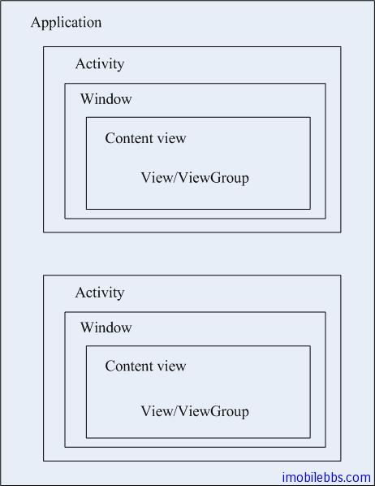
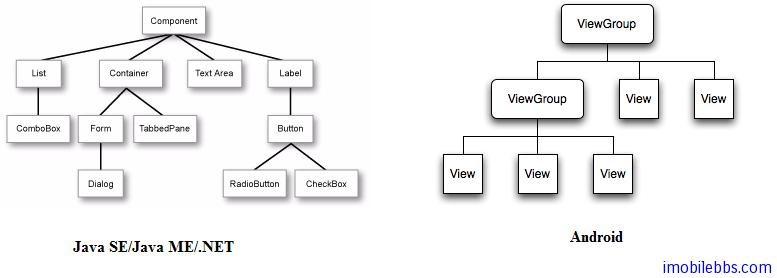
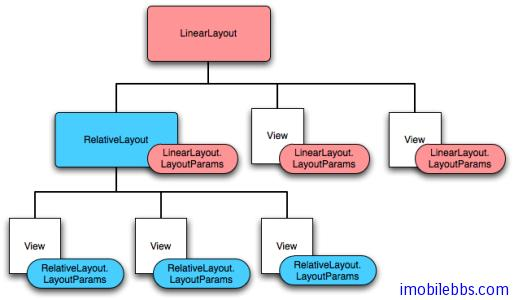
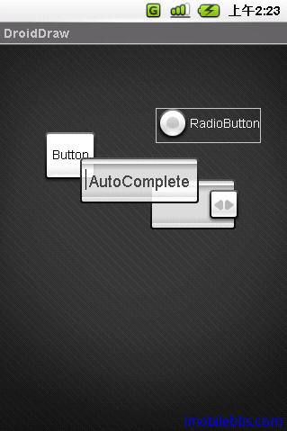
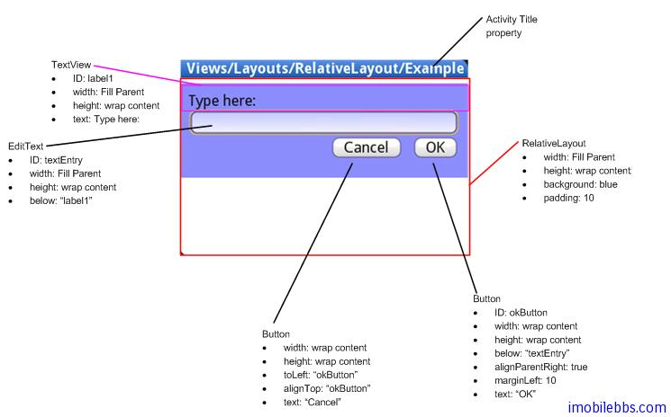

# 用户界面设计

Activity 是 Android 应用用户界面的基本组成部件。但 Activity 本身并不提供用户界面(User Interface)。从程序结构层次上来说，一个 Android 应用是类 android.app.Application 的一个实例， Application 中可以包含多个 android.app.Activity 实例。每个 Activity 带一个Window 类，这个类在 Android 平台上没有提供太多功能，主要可以用来控制标题栏（屏幕顶端）。比如设置UI全屏显示可以使用如下代码：

```
requestWindowFeature(Window.FEATURE_NO_TITLE);  
getWindow().setFlags(WindowManager.LayoutParams.FLAG_FULLSCREEN,   
                                WindowManager.LayoutParams.FLAG_FULLSCREEN);
```

Activty 缺省是不含用户界面，如需显示用户界面，则可以调用 setContentView()来设置 Activity 的 ContentView。 ConentView 描述了具体的 UI 组件，如文本框，标签，列表框，图片框的。



Android 的用户界面其实就是指 ContentView 的设计。“View”开始会使人产生误解，在其它平台“View”一般指类似Form的概念。而在 Android 平台上 View 是 UI 组件，相当于其他平台的Component，ViewGroup 相当于其它平台的 Container，如下图所示：



有了这个对应关系就很容易将你已有的用户界面设计知识用在 Android 的用户界面设计上来。

此外 Android 用户界面设计一个推荐的方法是使用 XML 来描述 UI，这也不是 Android 平台的首创，Java ME Polish，WPF，Silverlight 等都采用 XML 来描述 UI，使用 XML 来描述的好处是将用户界面和程序逻辑分开，可以做到用户界面的改变不影响程序逻辑，程序逻辑的变动也可以不影响用户界面，实际上是采用了 MVC 模式的设计。Activity 是 MVC 中的 Controller，Activity 的ContentView 则是 MVC 中的 View。如果你不想使用 XML 来描述 UI，也可以使用代码来创建 UI，不过这种方法既麻烦，也增加了模块之间的耦合度。

理解了 Android 的 View 和 ViewGroup 之后，具体设计用户界面并不复杂，一般来说 ViewGroup定义它的子 View 的布局 Layout，也就是其它 View （文本框，标签等控件或是其它 ViewGroup）在用户界面的位置安排。如上图所示，这个层次关系可以嵌套。通过嵌套，你可以定义出任意用户界面。



Android 中的基本布局如下：

FrameLayout   
 最简单的布局对象     
 在屏幕上故意保留的空白空间，你可以之后填充一个单独的对象   
 例如：一个你要更换的图片    
 所有子元素都钉到屏幕的左上角    
 不能为子元素指定位置    
LinearLayout       
 在一个方向上(垂直或水平)对齐所有子元素    
 所有子元素一个跟一个地堆放  
 一个垂直列表每行将只有一个子元素(无论它们有多宽)  
 一个水平列表只是一列的高度（最高子元素的高度来填充）  
TableLayout  
 把子元素放入到行与列中  
 不显示行、列或是单元格边界线  
 单元格不能横跨行，如 HTML 中一样  
AbsoluteLayout  
 使子元素能够指明确切的X / Y 坐标显示在屏幕上  
 (0,0)是左上角  
 当你下移或右移时，坐标值增加  
 允许元素重叠(但是不推荐)  
 注意：  
 一般建议不使用 AbsoluteLayout 除非你有很好的理由来使用它  
 因为它相当严格并且在不同的设备显示中不能很好地工作  



RelativeLayout
 让子元素指定它们相对于其他元素的位置(通过 ID 来指定)或相对于父布局对象



如果不喜欢 Eclipse IDE 自带的 UI 设计工具，可以使用免费 Android UI 设计软件 DroidDraw，[下载 DroidDraw](http://www.droiddraw.org/)。

Android SDK 的 ApiDemo 中也介绍 Android 提供的各个 UI 组件（Menu，Dialog，TextView，Button，List 等以及各个 Layout）的用法。这里就不一一介绍了。

Tags: [Android](http://www.imobilebbs.com/wordpress/archives/tag/android)

